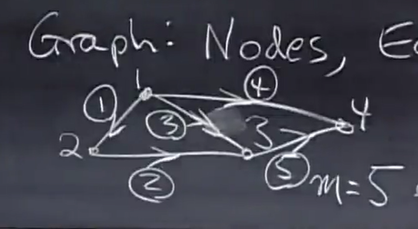
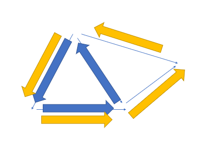
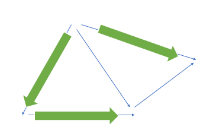

# 12.图和网络

---

## 1. 图

图是点和边组合而成的数学模型。

## 2. 关系矩阵

教授用的不是邻接矩阵的概念

对于如下图所示的这么一个图：

### a. 表示

$$
M =
\begin{bmatrix}
-1 & 1 & 0 & 0 \\
0 & -1 & 1 & 0 \\
-1 & 0 & 1 & 0 \\
-1 & 0 & 0 & 1 \\
0 & 0 & -1 & 1 \\
\end{bmatrix}
$$

这里，5 行表示的是 5 条边， 4 列表示的是 4 个顶点。

离散数学里面应该是这样表示的：

$$
n = |V| = 4, \ \ m = |E| = 5
$$

### b. 构成“回路”

正如上图中的边 1, 2, 3，它们在此看作一个回路（不考虑有向图的方向问题，暂且将有向图以无向图的角度判断回路）
那么，上述三条边可以构成一个回路，观察矩阵的1, 2, 3行，可以发现这三行是线性相关的。

$$
row 3 = row 1 + row 2
$$

（类似向量的加法，本质应该也就是用行向量表示有向图中的边）
**如果某条边可以被其他边线性表示，说明他们在矩阵中对应的行线性相关。**

**并且如果可以表示，那么说明这些边构成了回路**。

同时扩展一下，如果要判定整个图是否有“回路”，该问题也就转化成了：

**该图的矩阵是否线性无关**。

1. 如果线性无关，那么这个图没有回路。
2. 如果线性相关，说明至少存在一条边可以表示为其余边中某些边的线性组合。所以有回路。

---

## 2. 零空间

### 000. MX = 0

同时，线性相关性问题可转化为求解零空间问题：

$$
MX = 0
$$

$$
\begin{bmatrix}
-1 & 1 & 0 & 0 \\
0 & -1 & 1 & 0 \\
-1 & 0 & 1 & 0 \\
-1 & 0 & 0 & 1 \\
0 & 0 & -1 & 1 \\
\end{bmatrix}
\begin{bmatrix}
x_1 \\
x_2 \\
x_3 \\
x_4 \\
\end{bmatrix}
= \begin{bmatrix}
0 \\
0 \\
0 \\
0 \\
0 \\
\end{bmatrix}
$$

$$
\begin{bmatrix}
x_2 - x_1 \\
x_3 - x_2 \\
x_3 - x_1 \\
x_4 - x_1\\
x_4 - x_3\\
\end{bmatrix}
= \begin{bmatrix}
0 \\
0 \\
0 \\
0 \\
0 \\
\end{bmatrix}
$$

上面三个等式都是等价关系。

而该矩阵的零空间就是：

$$
x_0 = c
\begin{bmatrix}
1 \\
1 \\
1 \\
1 \\
1 \\
\end{bmatrix}
\qquad
一个特解：
\begin{cases}
x_1=1 \\
x_2=1 \\
x_3=1 \\
x_4=1 \\
x_5=1 \\
\end{cases}
$$

看到零空间的基只有一个向量表示时，说明零空间维数 $dim = 1$
而由公式 $dim(N(M)) = n - R(M)$，我们得到 $R(M) = 3$

而教授想用这个方程：$MX = 0$ 来表示两节点之间电压降为 0 的现实。

### 001. M^TY = 0 中的 KCL

之后考虑矩阵 $M$ 的转置 $M^T$:

$$
M^T =
\begin{bmatrix}
-1 & 0 & -1 & -1 & 0 \\
1 & -1 & 0 & 0 & 0 \\
0 & 1 & 1 & 0 & -1 \\
0 & 0 & 0 & 1 & 1 \\
\end{bmatrix}
$$

对于矩阵： $M^T Y = 0$, 有：

$$
\begin{bmatrix}
-1 & 0 & -1 & -1 & 0 \\
1 & -1 & 0 & 0 & 0 \\
0 & 1 & 1 & 0 & -1 \\
0 & 0 & 0 & 1 & 1 \\
\end{bmatrix}
\begin{bmatrix}
y_1 \\
y_2 \\
y_3 \\
y_4 \\
y_5 \\
\end{bmatrix}
= \begin{bmatrix}
0 \\
0 \\
0 \\
0 \\
\end{bmatrix}
$$

对于这个等式，有着许多需要说明的地方:

1. 这个矩阵的行来自于原矩阵的列。回想原矩阵 $M$, 其行的 -1 元素表示存在一条边从某一节点出发。
2. 看矩阵 $M^T$ 的行，比如第一行的元素分别为：-1，0，-1，-1，0。其中 -1 的个数表示节点 1 的 **出度** 。
3. 第一行所列方程为：$-y_1-y_3-y_4 = 0$, 如果把 $y_i$ 视作电流，那么此就为节点 1 的 **KCL方程** 。

### 010. M^TY = 0 的解

现在这个矩阵是 4 * 5 的，那么就可以有：

$$
dim(N(M^T)) = m - R(M^T)
$$

而此时 $m = 5, R(M^T) = 3$。
（别忘了 $R(M^T) = R(M)$ 这个等式）

所以，原矩阵转置后的零空间维数为 2。

我自己解得这个矩阵方程的解空间为：

$$
Y = c_1
\begin{bmatrix}
1 \\
1 \\
0 \\
-1 \\
1 \\
\end{bmatrix} + c_2
\begin{bmatrix}
1 \\
1 \\
-1 \\
0 \\
0 \\
\end{bmatrix}
$$

1. 注意看这个解，基中每一个向量都是图中“回路”的表示方法，且**这些“回路”互相独立**（无法互相表示，其原因是这些向量线性无关）
2. 也就是说转置矩阵的零空间表示着图中所有的“回路”。
3. 教授的说法，也就是按不积累电荷的情况下的电路回路
4. 我是通过消元法硬解出来基础解系的。但是有了（1.）的思想，我们也可以通过画图的方法直接写出基础解系。比如下面：

黄色和蓝色的箭头分别表示一个回路，也分别表示零空间基的其中一个向量。
（**由于两个回路不能互相表示，并且零空间维数为 2 ，所以它们可以表示零空间所有向量**）
（即表示所有令方程成立的向量）
（即表示所有“积累电荷”为 0 的电路）

### 011. 最小生成树

如果我们一开始不知道秩 $R(M^T)$，
由于上面（10.）中已经描述过：
$$
dim(N(M^T)) = 2
$$

由 $dim = m - R(M^T)$，我们得到秩的大小。
最大线性无关组即基础解系，其“相对”的一个概念叫做主列。
（主列即主元，为**规范的行阶梯形矩阵**每一行第一个为 1 的元素所在的列）
（主元有很多好玩的性质）

在这个转置矩阵中，其主列就是第 1, 2, 4列。之所以上面写"相对"两个字……可能只是因为加减关系而已吧……

而在这个图中，其主列表示的边为：

我们可以把这主列表示的三条边看作一个新的图。自然这个新的图是原图的一个子图。

但是这个子图却可以通过线性运算（这里可以类比向量加法）得到**原图中存在，但是不存在于这个新的子图**中的其他边。

我们可以看向这个子图：

1. 直观地看，这个子图**没有回路**，没有回路的图可以称作“**树**”。
2. 究其原因，子图没有回路是因为它由主列得到。所以他们所在列组成的新矩阵，列与列之间**线性无关**。

### 100. 欧拉公式

由于我们知道：

$$
dim(N(M^T)) = m - R(M^T)
$$

而这些量的含义为：

$$
\begin {cases}
dim(N(M^T)): 独立回路的个数\\
\qquad \qquad \qquad (也是平面的面数 - 1)\\
m：边数 \\
R(M^T)：节点数 - 1 \\
\end {cases}
$$

所以可以得到：
平面的面数 - 1 = 边数 - （节点数 - 1）

也就是：
节点数 - 边数 + 平面的面数 = 2 （V - E + F = 2）

---

## 3. 总结

$$
\begin{cases}
MX = 0\ \ （电压降方程）\\
Y = CX\ \ （欧姆定律）\\
M^T Y = 0 （基尔霍夫电流定律）\\
\end{cases}
$$

总结起来就是：

$$
(M^T C M) X = 0
$$
