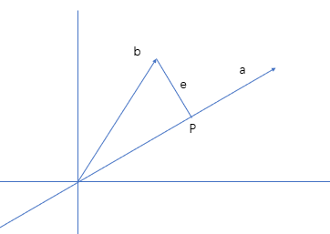
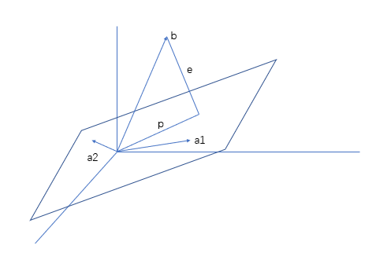

# 15. 子空间投影

---

## 1. 向量在向量上的投影

### i. “误差”二字

#### a. “误差的引入”

正如下图所描述的这样：



向量 $a$ 与向量 $b$ 并不是正交关系，但是由 $b$ 向量的终点做一条线段垂直于向量 $a$，相交于点 $P$。
由于我是做的垂线 $e$，所以必然地有 $e \perp a$ , 教授说，就把 $e$ 看作一个误差。

#### b. 个人从 PCA 角度的理解

这里如果只看这一个部分其实有点不好理解。
我认为这个事情应该这么看：

首先线代从开头到现在，所有向量的起点都是坐标原点。这其实就是一个**中心化**的结果。

在处理生活当中的一般数据时，我们大多数遇到的数据的中心（我的意思就是均值）并不在坐标原点，这个时候我们要对所有的数据减去均值。

我们可以把所有的数据都与坐标原点连接起来，看作**以原点为起点的向量组**。

由上一节的内容，我们很快就可以得知：

如果把每一个点的坐标以行向量方式表示为：

$$
x =
\begin{bmatrix}
x_1 & x_2 & \cdots & x_n
\end{bmatrix}
$$

每一个点到原点的距离 $||x||^2$ 为：

$$
||x||^2 = \sum_{i=1}^{n}x_i^2
$$

这个时候，如果我**考虑**有 一个 $(n-m)$ 维空间，并作 $(n)$ 维空间中所有**样本点**在这 一个低维空间 上的**投影**。

原本分布在高维空间中的样本点，就好似**降维**一般，被投影到了低维空间中。

有的时候就需要如此，特别是当**有一些维度所要描述的特征可以被其他特征表示，或者就近似于其他特征之时。** 此时对样本数据进行降维是一种好的方法。

但是如何降维，却是一个问题。

```15
如果手段欠佳，那么即使是非常相关的两个特征，也得不到好的结果。
```

那么我们就需要考虑**误差**。
（即如何用更好地保持原本信息）

#### c. “误差”最小

对于投影，如果我们要保持原本信息，就需要原样本在新的空间中仍会保持“类似”的分布。这是显然的。
而若要令这个分布尽可能地与原样本中传达的信息近似，那么就需要产生的噪声尽量小。（这是一个此消彼长的关系，信噪比，噪声越大，原信息表达得越差。）

我们换个角度来想：

1. **如果原样本点都落在新的空间上**，那么可以说这种**投影没有误差**，样本点还保持着原本的所有性质。
2. 相反，**如果原样本点经过投影全部落于一点**，那么可以说这个**误差太大**了，甚至可以说是最大的。这种投影消除了原本所有的信息。

所以在上图中，我们可以先不利用线代的知识，得到总误差

$$
err = \sum_{i=1}^{n} ||x||^2sin^2\theta
$$

其中， $\theta$ 是 向量 $a$ 与 $b$ 的夹角。

### ii. 矩阵角度表示投影

#### a. 投影表示

教授是利用矩阵表达出了这个误差的关系，利用的是正交关系成立的等式：

$$
a^T(b - xa) = 0
$$

其中，$x$ 是一个常数，表示的是向量 $b$ 投影在向量 $a$ 上之后长度与 $a$ 原本长度之比。

由此可以计算出：

$$
x = \frac{a^Tb}{||a||^2}
$$

上高中时，我高考的时候，第 18 题基本上都是立体几何这道大题，其中的第 (2) 个小问基本都需要求二面角的平面角，在这过程中，如果不使用几何方法，靠建坐标系一定会用到一个公式：

$$
cos\theta = \frac{a · b}{|a||b|}
$$

其中 $a, b$ 是两个向量。
这二者之间有一种相似。（尽管下面一个是 $||a||^2$ 与 $|a||b|$） $x$ 表示的是**投影与被投影的向量原长度**之比。

所以令投影表示为 $p$：

$$
p = ax = a \ \frac{a^Tb}{||a||^2}
$$

可以看出：

* 当 $a$ 变化， 投影不变
* 当 $b$ 变化， 投影变化相同倍数

#### b. 投影矩阵

如果有一个矩阵，可以使得向量 $b$ **直接投影**到 向量 $a$ 上，这个矩阵设为 $P$, 那么其可以被表达为：

$$
p = Pb = a \ \frac{a^Tb}{||a||^2} = \frac{aa^T}{||a||^2} \ b
$$

所以：

$$
P = \frac{aa^T}{||a||^2} = \frac{aa^T}{a^Ta}
$$

对于新得到的矩阵 $P$, 它有以下几个性质：

1. $R(P) = 1$
2. $C(P) = 过\ a\ 的直线$
3. $P^T = P$
4. $P^n = P$

对于第一个性质，这个很容易想到，$R(aa^T) = R(a) = R(a^T) = 1$ （现在这里 $a$ 是列向量）

第二个性质可能要说明一下，一个矩阵的列空间，其实就是一个矩阵 右乘 任意列向量 得到的向量集合。
换一种说法，就是**一个矩阵的所有列向量的所有线性组合的集合构成的向量空间**。
此处计算投影的方法是：“右乘任意向量”，那么得到的就是**列空间**。
再加上几何上的直观感受：投影计算的最终结果，肯定落在同一条空间上。（**在这个例子里面是落在直线上**）
也就是说，列空间为一条过原点的空间。

---

## 2. 高维情况

### i. 方程无解

正如上面所说的那样，投影的目的就是使得一些不好的样本“好起来”。

上一节说过，对于矩阵方程：

$$
AX = b
$$

这个方程并不是时时刻刻都是有解的。
因为给出的**未知数的数目**可以**远远小于**给出**方程的数目**。

换一种说法，**$Ax$ 总在 $A$ 的列空间中。但是 $b$ 却不一定总在其中**。
这也就是导致**方程无解的根源**。

如果需要“求解”这个“方程”，那么我们就需要对原本的方程进行转化：

$$
\begin{cases}
A \hat x = p \\
\\
p = Pb \\
\end{cases}
$$

（注：现在这个矩阵 $A$ 就不是一个列向量了。）

### ii. 几何角度

如下图所示：


对于一个平面，其最大线性无关组由两个基向量组成，也就是说，它的**列空间维数为 2** 。
如果我们要做一个直线对平面的投影（指空间），那么我们就需要找到在多维情况下的投影矩阵。

按照一维，也就是直线情况下的方程。

$$
\begin{cases}
p = x_1a_1 + x_2a_2 \\
\\
p = b - e \\
\end{cases}
$$

我们将其全部表示为矩阵形式：

$$
\begin{cases}
A = [a_1 \quad a_2] \\
\\
X = \begin{bmatrix}
x_1 \\
x_2 \\
\end{bmatrix}
\end{cases}
$$

对于 $A$ 和 $X$，可以稍稍解释一下：
$A$ 可以这样表示是因为 $a_1, a_2$ 两个就是其最大线性无关组的基向量，所以这只是其中一种表示方法而已，但是这种表示方法已经可以囊括 $A$ 中的所有向量了。
有了如此的 $A$ ，才会有如此的 $X$ 。

又由于 $e$ 垂直于平面，所以其垂直于平面内的任何一个向量。
正好 $a_1, a_2 \in plain, $ 所以我们得到以下两个等式：

$$
\begin{cases}
a_1^T (b - p) = 0 \\
\\
a_2^T (b - p) = 0 \\
\end{cases}
$$

其可以写成：

$$
A^T(b - AX) = O
$$

对于这个等式，可以从子空间角度考虑，进行验证。
$e = b - AX$, 那么由于 $A^Te = O$，所以 $e$ 在 $A^T$ 的零空间中。又由上一节的知识：我们知道一个矩阵的**零空间与其转置矩阵的列空间垂直**。所以 **$e \perp C(A)$**。（列空间维数为 2 ，那个平面就是列空间）

$$
X = (A^TA)^{-1}A^Tb
$$

$$
p = AX = A(A^TA)^{-1}A^Tb = Pb
$$

如果 $A^T,\ A$ 是可逆的，那么 **$P = I$**, 这个事情可以被解释：

1. 首先因为可逆，所以该矩阵一定是满秩的。所以 $R(A^TA) = R(A) = n$，（**这个结论对于任意矩阵成立，不一定是方阵**）

    对于原先那个问题，又有如下角度可以做进一步解释：

    1. 由一个用了很久的等式：$dim(N(A)) = n - R(A)$, 所以不难得出 $N(A)$ 的维数为 0 。

    2. 换一个角度解释，由于 **零空间与行空间垂直**， 而这个时候行空间维数为 n。（**列空间维数也为 n， 可以形象地考虑 AX 指的是 A 的列的所有线性组合**）行空间的正交补，也就是零空间的维数为 0 。

    3. 再换一个角度解释：由于 $b$ 已经是一个 $n$ 维空间中的向量了，但是它依旧在向 $n$ 维空间中做投影操作。

    ```所以空间中不存在一个非零向量与行空间垂直了。```

2. 在本例中，也就是等价于找不到那个非零向量，表示误差的 $e$。
    如果 $e$ 是一个零向量，那么投影前后，岂不是都是相同的。（因为**误差为 0** （这里利用“误差”的字面意思就完美地解释了））

即使这里 $A^TA$ 是可逆的，但是要得到 **$P = I$**， 其中中间还有一个要求，那就是 $A$ 是一个方阵，因为要化简，所以必须保证 $A$ 本身就有逆。
但是在这里，其非方阵。
（需要注意的是， **$A$ 可逆和 $A^TA$ 可逆并不是等价关系**。前者成立，后者一定成立，但是后者成立，前者却不一定。正是因为 **$A$ 可能不是方阵，但其秩可以等于列**）

所以不能利用逆的性质进行化简，结果只能是：

$$
P = A(A^TA)^{-1}A^T
$$

对于这个 $P$, 仍然有如下性质：

1. $R(P) = 1$
2. $P^T = P$
3. $P^n = P$

---

## 3. 最小二乘

教授给了一个二维坐标系，其上有三个样本点。
这些点的坐标为：
$P_1(1,1), P_2(2,2), P_3(3,2)$

设过三点的直线方程为：$y = Dt + C$, 则有：

$$
\begin{cases}
C + D = 1 \\
C + 2D = 2 \\
C + 3D = 2 \\
\end{cases}
\quad
\Rightarrow \quad
\begin{bmatrix}
1 & 1 \\
1 & 2 \\
1 & 3 \\
\end{bmatrix}
\begin{bmatrix}
C \\
D \\
\end{bmatrix}
= \begin{bmatrix}
1 \\
2 \\
2 \\
\end{bmatrix}
$$

这个方程是无解的。
但是却可以有不是解的“最优解”。

这个“最优解”就是下面方程的解:

$$
A^TA \hat X = A^T b
$$

这个方程是一个有解的方程。
（由此也可以看出，方程两边同时乘一个矩阵，原本无解的方程不一定仍然无解。）
