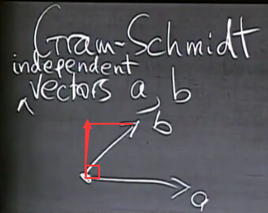

# 17. 正交矩阵与正交化

## 1. 标准正交基

构造一组向量，其中每个向量都与其余向量正交：

$$
q_i^Tq_j = \begin{cases}
0 \quad if \ i \ne j \\
1 \quad if \ i = j \\
\end{cases}
$$

## 2. 标准正交矩阵

### i. 各列向量相互正交的矩阵

将（1.）中的向量放入同一个矩阵中，记该矩阵为 $Q$。
于是有:

$$
q_i^Tq_j = \begin{cases}
0 \quad if \ i \ne j \\
1 \quad if \ i = j \\
\end{cases}
\qquad (q_i, q_j \in Q \quad i, j = 0, 1, \cdots, n)
$$

上一节，对于普通的矩阵 $A$，考察过 $A^TA$ 这个矩阵的部分性质。那么在这里，由于这类矩阵更加特殊的性质存在，所以可以尝试观察矩阵 $Q^TQ$。

$$
Q = \begin{bmatrix}
q_1 & q_2 & \cdots & q_n
\end{bmatrix},
\quad
Q^T = \begin{bmatrix}
q_1 \\
q_2 \\
\cdots \\
q_n \\
\end{bmatrix}
$$

那么，就有：

$$
Q^TQ =
\begin{bmatrix}
1 & 0 & \cdots & 0 \\
0 & 1 & \cdots & 0 \\
\vdots &  & \ddots & \vdots \\
0 & 0 & \cdots & 1 \\
\end{bmatrix} = I
$$

在这里，根本不需要其他任何条件，不需要 $q_i$ 为 $n$ 维向量，不需要考虑 $Q$ 的形状。只要是**各列向量相互正交**的矩阵，其转置乘上本身就是单位阵 $I$。

但是对于**正交矩阵**这个名词，教授专门点出，其仅限于**各列向量相互正交**的**方阵**

### ii. 正交矩阵

如果一个矩阵是正交矩阵，那么它一定满足下式：

$$
Q^T = Q^{-1}
$$

由这个式子，我们可以看出，一个矩阵被称为正交矩阵，首先它是要**可逆**的。
一旦一个矩阵可逆，也就意味着它是一个**方阵**。

设矩阵 $Q$,

$$
Q = \begin{bmatrix}
0 & 0 & 1 \\
1 & 0 & 0 \\
0 & 1 & 0 \\
\end{bmatrix}, \quad
Q^T = \begin{bmatrix}
0 & 1 & 0 \\
0 & 0 & 1 \\
1 & 0 & 0 \\
\end{bmatrix},
$$

$$
Q^TQ = \begin{bmatrix}
1 & 0 & 0 \\
0 & 1 & 0 \\
0 & 0 & 1 \\
\end{bmatrix},
$$

**（这其实很好理解。如果在 $Q$ 中 $q_{ij} = 1$, 那么 $Q^T$ 对应的元素就是 $q_{ji} = 1$。在矩阵乘法计算 $Q^TQ$ 时，正好是 $q_{ij}q_{ji}$。这个计算的结果正好是结果矩阵 $Q^TQ$ 的 $i$ 行 $i$ 列元素）**

### iii. 其他的“正交矩阵”

#### a. 有角度

$$
\begin{bmatrix}
cos\theta & -sin\theta \\
sin\theta & cos\theta \\
\end{bmatrix}
$$

#### b. 有系数

$$
\begin{bmatrix}
1 & -1 \\
1 & 1 \\
\end{bmatrix}
$$

这个可不是正交矩阵，虽然它各列向量均为正交关系，但是每一个列向量的长度却不是 1 。

$$
\frac{1}{\sqrt{2}}
\begin{bmatrix}
1 & -1 \\
1 & 1 \\
\end{bmatrix}
$$

而这个矩阵就是一个正交矩阵。

#### c. 哈达玛矩阵

$$
\begin{bmatrix}
1 & 1 & 1 & 1 \\
1 & -1 & 1 & -1 \\
1 & 1 & -1 & -1 \\
1 & -1 & -1 & 1 \\
\end{bmatrix}
$$

值得注意的是，如果**不想计算**，要检查这个矩阵是不是正交阵，需要看两点：

1. 任意两个列向量之间，同行元素作异或（xor）操作，得出结果，如果其中 **0 的数目** 等于 **1 的数目**，那么说明列向量两两正交。
2. 任意列向量的长度为 1 。

明显这个只满足第一个。
如果先让这个矩阵变为正交矩阵，就需要在前面乘上一个 $\frac{1}{2}$。

$$
\frac{1}{2}
\begin{bmatrix}
1 & 1 & 1 & 1 \\
1 & -1 & 1 & -1 \\
1 & 1 & -1 & -1 \\
1 & -1 & -1 & 1 \\
\end{bmatrix}
$$

这就是一个正交矩阵。
当然原矩阵还有一个特殊的名字，叫做 **哈达玛矩阵**。
除此之外，哈达玛矩阵有以下性质：

1. 哈达玛矩阵只能是 $4k$ 阶矩阵，其中 $k \in Z^+$。
2. 每行 / 每列的平方和为矩阵的阶数。

这个矩阵可以干一些事情，在数学方面的话，估计后面的小节也会讲到。

## 3. 施密特正交化

记得线性代数考试前两周，我对施密特正交化的应用仅仅停留在诸如“正交矩阵、标准型”的“系统解法”中。
在期末考试前两天，我才开始对整个学期学到的线代知识进行复习。也就是这个时候才理解到施密特正交化的本质。
一开始我还觉得这个方法蛮神奇的。通过及其复杂的运算（书上写的公式没有用到任何 $\sum$ 符合，所以看起来很长）得到了一组互相垂直的向量。

但是我仔细推演后，就发现**施密特正交化**这个方法**只是在干它应该干的事情而已**。

### i. 标准方程

给定一个**各列向量相互正交**的矩阵 $Q$。

考虑其对应的投影方阵 $P = Q(Q^TQ)^{-1}Q^T$。
由于 $Q^TQ = I$, 所以 $P = QQ^T$。
这个时候需要进行一波讨论：

1. 如果 $Q$ 是一个方阵，那么 $QQ^T = I, P = I$（可以看作**只要 $Q$ 为方阵，那么 $Q$ 就是可逆阵**。由上一小节的内容，可以得到这个结果）
2. 如果 $Q$ 不是方阵，实际上最后得到的 $QQ^T$ 中一定存在至少一列全为 0 （既然不为方阵，说明 $R(Q) < m\ or\ R(Q) < n$ ）
    又由 $dim(N(Q)) = n - R(Q); dim(N(Q^T)) = m - R(Q^T)$ 所以零空间维数,或者是转置矩阵的零空间维数一定大于 0 。
    所以一定会有一列全为 0 。

对于上一节的标准方程：$A^TA \hat X = A^Tb$,
如果其中 $A = Q$, 那么就会有：$\hat X = Q^Tb \quad（Q^TQ = I）$

### ii. 施密特正交化

我相信仅仅是这个图就能够让我重新回忆起教授的话：



施密特正交化开始于一组**线性无关**的向量。

**线性无关**这个限定十分的关键。

试想，如果一组向量是线性相关的，就比如这一组向量只有两个，并且它们为二维向量。
如果它们线性相关，它们**张成的空间**一定不会是一个二维空间。它们**缺少**对**除它们本身之外**的第二个维度的描述。
从而也就不存在能够求出两个互相正交的向量的可能。

施密特正交化先选取任意一个向量为基准向量，后续的所有操作，都与这个向量有关。

如上图所示，如果我们选取 $a$ 作为 $A$，那么我们就应该对 $b$ 做一个操作令其与 $A$ 正交。

由上一个小节，我们可以得到一种简单的方法。那就是左乘矩阵 $(I - P)$。

回顾一下，其中 $P = \frac{aa^T}{a^Ta}$。

那么：

$$
B = (I - \frac{AA^T}{A^TA})b = b - \frac{A^Tb}{A^TA}A
$$

（由于 $b$ 和 $A^T$ 分别是一维行向量和列向量，所以 **$A^Tb$ 实际上是一个数**，所以在第二个等号后进行了一些变换，旨在**令 $A$ 前为一个系数，而非变量**）
只要再除以 $||B||^2$ 就可以得到 $q_2$。

如果我们还需要对第三个维度上进行施密特正交化，那么还需要给出第三个向量，且这个向量与另外两个之前给出的向量 $a, b$ 线性无关，或者说和 $q_1, q_2$ 线性无关。

$$
C = (I - \frac{AA^T}{A^TA} - \frac{BB^T}{B^TB})c
$$

对于这个正交化过程，有几点需要进行说明：

1. 正交化前后的两个矩阵表示的**列空间是同一个。**
    原因是：正交化相当于在**求原矩阵的正交基**。形象地比喻一下，求基的过程相当于 **“SELECT”**（查询操作），而非 **“UPDATE”**（修改操作）。
2. 正交化前的矩阵，可以被正交化后矩阵中的列向量组表示出来。
3. 正交化前的矩阵，如果向正交化后矩阵中的列向量做投影，得到的倍数 $x$，可以**表示坐标**。
4. 施密特正交化虽然麻烦，但是它至少方便了后续的运算。
    （也就是，我得到的就应该仅仅是我需要的。）

### iii. QR分解

#### a. QR分解的来龙去脉

$QR$ 分解也叫正交三角分解。

由（ii.）知道，**正交化前后的两个矩阵表示的列空间是同一个。**
所以一定会存在一个矩阵，或者说一个变换 $R$, 使得：

$$
A = QR
$$

（因为列空间相同的矩阵之间 可以通过乘可逆矩阵互相转化。）

我们可以用矩阵的方式展开表示：

$$
\begin{bmatrix}
a & b \\
\end{bmatrix}
= \begin{bmatrix}
q_1 & q_2 \\
\end{bmatrix}
\begin{bmatrix}
a^Tq_1 & b^Tq_1 \\
\\
a^Tq_2 & b^Tq_2 \\
\end{bmatrix}
$$

这里可能不是很好理解，但是实际上，只是教授在这里只是因为黑板太小写不下了而已。

对于上面的矩阵方程，可以转化为如下的方程组：

$$
\begin{cases}
a = (a^Tq_1) q_1 + (a^Tq_2) q_2 \\
\\
b = (b^Tq_1) q_1 + (b^Tq_2) q_2 \\
\end{cases}
$$

其中，$(a^Tq_1), (a^Tq_2), (b^Tq_1), (b^Tq_2)$ 都是实数。
另外，这方程组可能很容易被看错。
事实上，上面这个方程组中**所有**的符号都代表**向量**。但由于小写字母的原因，很**容易误解为实数**，进而导致出现类似：$(a^Tq_1)q_1 = a^T ||q_1||^2$ 的错误。

好了，现在说明一下这个方程组，
$a^Tq_2 = 0$，其余实数有些可能是 0 ，也可能不是。
个中原因，就是：

```17
越先被纳入施密特正交化算法的向量，越先被当作所谓的“标准”。
此处的“标准”，意味着后续向量的 “任务” 就是必须要 “垂直” 之前已被纳入的“标准”。
```

如果我更换一下字母，**仅仅在这个（iii.a）中进行以下替换来方便理解**

$$
\begin{bmatrix}
a & b & \cdots \\
\end{bmatrix} =
\begin{bmatrix}
a_1 & a_2 & \cdots & a_n \\
\end{bmatrix}
$$

那么就会有：$a_iq_j = 0 \quad (i < j)$
用上面放在“代码框”中的话来举个例子，并用语言说明原理：

* 就是 $a_1$ 算是**最先被纳入算法中**的，那么**后续的 $q_1, q_2, \cdots, q_n$** 都要以 **垂直于 $a_1$** 为目标，**不然就不是正交化操作**。
* 同时，施密特正交化，究其根本，就是 “令新的向量 $a_k$ 不断正交于前面 **所有已选择 并且 两两正交化 后的向量**”的过程。（下标表示任意一个在(1, n)范围中的整数）

虽然这个方程组只有两个等式，但是如果把它扩展到 $n$ 个等式的情况。其中也会**有很大一部分实数为 0**。
而事实上，$QR$ 分解中的 $R$，代表着上三角阵。

#### b. 在QR分解之前

在了解 $QR$ 分解之前，我们在求秩的时候，都要通过一定次数的行变换，使得一个普通的矩阵，转化为一个行阶梯形矩阵。

但行阶梯形矩阵不就是个上三角阵吗？

$$
A = QR
$$

这个等式是 $QR$ 分解用矩阵方程的表达，即**任意**一个矩阵 $A$，**都可以**写作**两个矩阵的相乘**的形式。
其中，**左侧矩阵列向量两两正交，右侧矩阵为上三角阵**。
