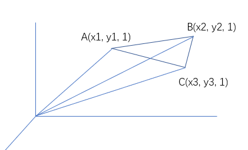

# 20. 克拉默法则，逆矩阵，体积

这是一节关于应用的内容。
在 18 节中，教授说过，行列式是可以尽可能包含所有信息的概念。

## 1. 逆矩阵

### i. 如何求逆

还记得教授在前面某一节的时候，突然就得出了一个结论，然后说道：

```20
it seems that I am too brilliant.
```

对于 2 阶方阵，教授直接得出了它的逆。

$$
A^{-1} =
\begin{bmatrix}
a & b \\
c & d \\
\end{bmatrix}^{-1} =
\frac{1}{ad-bc}
\begin{bmatrix}
d & -b \\
-c & a \\
\end{bmatrix}
$$

这个如果按照前面两节的知识来看，能够突然得出结论，应该是应用了 **性质九**：$det\ A = \frac{1}{det\ A^{-1}}$。

不得不说，真的像少听了一节，这里还应用了：

$$
A^{-1} = \frac{C^T}{det\ A}
$$

（此处 $C$ 也为矩阵，其矩阵第 $i$ 行第 $j$ 列元素为矩阵 $A$ 第 $i$ 行第 $j$ 列元素的代数余子式）
（在童祭大学线代中，$A^* = C^T$）

### ii. 为什么可以这样求逆

如果要想验证上面这个式子，其等价的形式为：

$$
(det\ A) I = AC^T
$$

那我们就要来看一看，等式右边到底都是些什么元素了。

对于矩阵 $C$, 重申一遍，**其矩阵第 $i$ 行第 $j$ 列元素为矩阵 $A$ 第 $i$ 行第 $j$ 列元素的代数余子式**。

$$
A =
\begin{bmatrix}
a_{11} & a_{12} & \cdots & a_{1n} \\
a_{21} & a_{22} & \cdots & a_{2n} \\
\vdots & \vdots & \ddots & \vdots \\
a_{n1} & a_{n2} & \cdots & a_{nn} \\
\end{bmatrix}, \quad
C^T =
\begin{bmatrix}
c_{11} & c_{21} & \cdots & c_{n1} \\
c_{12} & c_{22} & \cdots & c_{n2} \\
\vdots & \vdots & \ddots & \vdots \\
c_{1n} & c_{2n} & \cdots & c_{nn} \\
\end{bmatrix}
$$

并且我们知道一个事实：

$$
\begin{cases}
det\ A = \sum_{j = 1}^{n}a_{ij}c_{ij} \\
\\
0 = \sum_{j = 1}^{n}a_{ij}c_{kj} \quad (i \ne k)
\end{cases}
$$

对于第一个式子，由于是定义所以很好理解。
但是第二个却需要一点手段。

教授教导我们，可以 **把 $\sum a_{ij}c_{kj}$ 也看作一个行列式** 的表示方法。
如果我要证明这个行列式的值是为 0 的，那么也就是要去说明一个行列式，其中 **必定有两行或者两列相同** 。

从这个角度来看的话，或许就很好理解了。

如果有这种情况发生，也就意味着：

```20
原矩阵第 i 行所有元素a(i,k) 乘上 伴随矩阵第 j 列所有元素c(k,j)
所表示的行列式为：
    1. 第 i 行与第 j 行相同；
    2. 第 i 列与第 j 列相同。
```

## 2. 克拉默法则

### i. 问题引入 AX = b

对于这个非齐次线性方程组：

$$
AX = b
$$

其解为：$X = A^{-1}b = \frac{1}{det\ A} C^T b$

对于等式右边，一个伴随矩阵乘上一个列向量。
正如教授所说的，得到的结果，也就是一个列向量，其中每一个元素都可以被看作： **一个数 * 一个代数余子式**。

### ii. 克拉默法则

这的确很容易让人联想到，其结果也可以表示为一个行列式。

$$
X =
\begin{bmatrix}
x_1 \\
x_2 \\
\vdots \\
x_n
\end{bmatrix},\qquad
\begin{cases}
x_1 = \frac{det\ B_1}{det A} \\
x_2 = \frac{det\ B_2}{det A} \\
\vdots \\
x_n = \frac{det\ B_n}{det A} \\
\end{cases}
$$

那么具体来说，$B_i$ 这个矩阵，等同于把 $A$ 的第 $i$ 列换成了 $b$。
对这个新矩阵求行列式，就对第 $i$ 列展开。

## 3. 行列式求体积

### i. 线性代数角度的证明

假设有一个三维立方体，其体积可以用行列式表示：

$$
|det\ A| = V(box) = |
\begin{vmatrix}
a_{11} & a_{12} & a_{13} \\
a_{21} & a_{22} & a_{23} \\
a_{31} & a_{32} & a_{33} \\
\end{vmatrix}|
$$

其中，将立方体的一个顶点放置于坐标原点，且以这一点引出的三条线段，其终点为

$$
A_1(a_{11}, a_{12}, a_{13}),\ A_2(a_{21}, a_{22}, a_{23}),\ A_3(a_{31}, a_{32}, a_{33})
$$

特别的，也可以用这个来证明行列式 **性质一，二，三**。
反过来，**如果这个“体积说”满足行列式最前面的三条性质，说明其可以推出后面 7 条性质**。也就是说，“体积说”可以用来解释一切行列式的性质和结论。（只不过是难易问题）

1. 对于 3 阶单位阵 $I$, 其所表示的三维立方体的体积很明显就是 1 。
2. 交换两行意味着两边位置交换，但是边位置交换**不影响体积大小**，但是有**可能影响体积的正负**。（根据左右手规则）
3. i. 对于 **性质三** 的第一条，一行乘某个倍数，行列式值也乘那个倍数。
    这个主要表现在一条边倍增，可以做辅助线，以等高法求体积。
    ii. 对于 **性质三** 的第二条，可以表现为同底立方体之间，计算体积可以直接加减，即等底法求体积。

综上所述，这说明 “体积说” 完全符合行列式的各个性质。

### ii. 高等数学角度的表达

但实际上，这个说法并不新奇。至少，在求体积方面，还有其他工具，或者说法可以使用。那便是：**混合积**。

对于空间中的三个向量 $a, b, c$，称 $(a \times b)\cdot c$ 为混合积。

如果我们将向量写作坐标形式：

$$
a(x_1, y_1, z_1), \quad b(x_2, y_2, z_2), \quad c(x_3, y_3, z_3)
$$

那么就有：

$$
a \times b =
\begin{vmatrix}
i & j & k \\
x_1 & y_1 & z_1 \\
x_2 & y_2 & z_2 \\
\end{vmatrix}, \qquad
(a \times b)\cdot c =
\begin{vmatrix}
x_3 & y_3 & z_3 \\
x_1 & y_1 & z_1 \\
x_2 & y_2 & z_2 \\
\end{vmatrix}
$$

可以对比一下，这不就是上面的那个式子吗。

### iii. 解析几何角度的验证

#### a. 3 维到 2 维

如果把维度降到 2 的话，那么我们会发现，计算一顶点落在原点的平行四边形面积，其公式为：

$$
S = ad-bc, \quad (A(a, b), B(c, d))
$$

而对于三角形，则只需要除以 2。

并且教授给出了一般三角形的计算公式：
当三角形三点坐标为 $A(x_1, y_1), B(x_2, y_2), C(x_3, y_3)$ 时，三角形面积 $S$：

$$
S = \frac{1}{2}
\begin{vmatrix}
x_1 & y_1 & 1 \\
x_2 & y_2 & 1 \\
x_3 & y_3 & 1 \\
\end{vmatrix}
$$

而这个式子相信中国大陆大多数高中在 解析几何 部分就已经讲过了。

#### b. 2 维到 3 维

这个其实是这么推出来的，由于：

$$
S = \frac{1}{2}
\begin{vmatrix}
x_1 & y_1 & 1 \\
x_2 & y_2 & 1 \\
x_3 & y_3 & 1 \\
\end{vmatrix}
$$

而事实上，我们知道：

```20
三角形面积，在数值上等同于以三角形为底，高为 1 的平行六面体的体积。
```



所以完全可以将此行列式看成 $A(x_1, y_1, 1), B(x_2, y_2, 1), C(x_3, y_3, 1)$ 三点构成的平行六面体的体积。

我们也可以对三角形三点坐标进行转化：

$$
A(0, 0), B(x_2-x_1, y_2-y_1), C(x_3-x_1, y_3-y_1)
$$

其面积由二阶平行四边形面积公式表示为：

$$
S = \frac{1}{2}
\begin{vmatrix}
x_2 - x_1 & y_2 - y_1 \\
x_3 - x_1 & y_3 - y_1 \\
\end{vmatrix}
$$

但实际上这个行列式就是由上面的行列式转化而来的。
