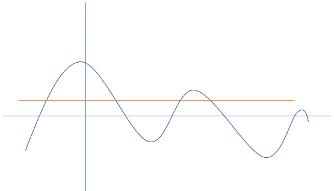
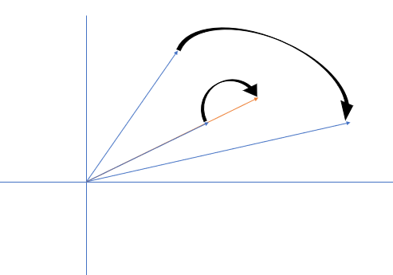
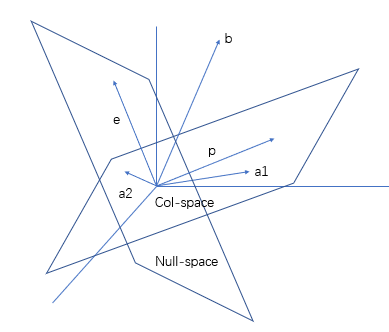
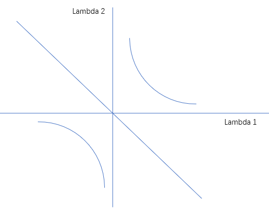

# 21. 特征值和特征向量

## 1. 特征向量

### i. 看待矩阵乘法的新视角

在这里，由之前的小节，我们可以知道：

```21
一个矩阵，左乘另一个矩阵，相当于对原矩阵进行行变换。
```

那么我们其实可以将这个过程看作一个函数的映射：

1. 首先，对于任意一个矩阵，左乘任意一个矩阵，得到的结果是唯一的。
2. 其次，相同的结果，可能是由不同的矩阵乘法得到。

所以我们看出，这是一个 **多对一** 的关系。
好似：



如果可以这么看的话，那么给定一个矩阵 $A$，令其左乘一个矩阵（向量） $X$, 就好比于将 矩阵（向量） $X$ 输入至矩阵 $A$ 中。

（由此可以联想到 **离散数学** 中的复合函数）

### ii. 特征向量是什么

现在，我们关注 $AX$ 这个矩阵乘法的结果。
我们由前面向量空间的知识，可以得知：**$AX$ 落在 $A$ 的列空间中**。
如果 $X$ 恰好就在 $A$ 的列空间中，那岂不是 $AX$ 平行 $X$？
这样的平行关系就可以表示成：

$$
AX = \lambda X \qquad(\lambda 为系数)
$$

在这里，$X$ 被称作特征向量， $\lambda$ 就是对应的特征值。



（注：矩阵对有些向量的改变是巨大的，**而对有些向量的改变只在一条直线上**。）

## 2. 特征值

### i. 经验上的情况（子空间解释）

如果对书本上的 特征值和特征向量 的例题还有些印象。是大概能想到：**奇异矩阵（不可逆矩阵）一定存在至少一个特征值为 0**。

这个或许可以通过前面关于 **子空间** 的理论解释：

如果一个矩阵 $A$ 是不可逆的，那么就表明以下事实：

* $R(A) < n$
* $dim(N(A)) > 0, \quad (因为\ dim(N(A)) = n - R(A))$
* $det\ A = 0$

我们先只看前面两个事实。
由于矩阵 $A$ 零空间维数不为 0，所以**一定存在**一系列的**非零向量** $X$, 使得 **$AX = O$**。

而我们都知道：

* 零向量和任意向量垂直；
* 零向量和任意向量平行。

所以处于 $A$ 零空间中的向量 $X$, 其本身就是 $A$ 的特征向量，且对应的特征值 $\lambda = 0$。

（注：在这里，零空间维数不一定是 1，只要其维数 $dim(N(A)) > 0$，那么一定会有为 0 的特征值）

### ii. 求解 AX = lambda X

对于这个方程，如果不进行任何处理直接求解，应该是有些困难的。

#### a. 投影矩阵的特征向量和特征值



回顾第 16 节的投影矩阵，我们考虑它的特征向量和特征值，之后再说原因。

**看到这个图，我们重新列出曾经的公式**：

$$
P = A(A^TA)^{-1}A^T
$$

1. **如果矩阵 $b$ 在列空间中，那么 $Pb = b$**；
2. **如果矩阵 $b$ 垂直于列空间，那么 $Pb = O$**；
3. 如果矩阵 $b$ 既不在列空间，也不垂直于列空间，那么其投影位于列空间中，且长度非零，即 $Pb = xa$, (x 为常数)。

##### α. 特征值为 1

发现什么奥秘了？
好像投影矩阵的 **性质1**，正好就 **对应着特征向量与特征值的定义**。

证明略掉，就简单说一嘴，如果 $b$ 在列空间中，而等式左边，$b$ 左乘矩阵 $P$, 显然 $Pb$ 位于 $P$ 的列空间中。
（将**三维空间中的球体投影到二维空间**，得到的是**圆形**。但是**三维空间中的球体投影到三维空间**，那不是**原地tp**吗? 得到的还是那个球体）

```20
由此可以发现，投影矩阵的特征值为 1，特征向量可以是 列空间中的任意向量。
```

进一步说，利用投影矩阵的性质：$P^n = P$,

$$
P^{n-1} Pb = Pb
$$

看，矩阵 $P^{n-1}$ 的特征值也为 1，特征向量为 $Pb$。

##### β. 特征值为 0

如果可能的话，我们还可以利用投影矩阵的 **性质2**。

试想，如果存在垂直于列空间，即位于转置矩阵的零空间中的向量。（此处，必须说明，转置矩阵指的是 $A^T， P = A(A^TA)^{-1}A^T$）
那么 $Pb = O, \ (A^Tb = O)$。

所以不难看出，投影矩阵的特征值为 0，且对应的特征向量可以是 转置矩阵零空间 中的任意向量。

#### b. 置换矩阵的特征向量和特征值

##### α. 两个特征值

还记得上一节的置换矩阵，在行列式中，可以看作两行（两列）进行交换；在空间坐标系中，可以看作两条棱的交换。

在这里，给出一个 2 阶的置换矩阵：

$$
A =
\begin{bmatrix}
0 & 1 \\
1 & 0 \\
\end{bmatrix}
$$

我们其实不难想到，如果要满足特征值和特征向量成立的式子，一个两行相同的向量是个不错的选择：$x_1 = (1, 1)^T$。这样的话，特征值为 1。

如果我们努力地想一想，还可以想到两行互为相反数的向量也可以满足等式：$x_2 = (1, -1)^T$, 此时特征值为 -1。

##### β. 迹

教授在知道其中一个特征值为 1 的情况下，立刻就得出了另外一个特征值。
这是因为教授的脑子里面有一个 **迹** 的概念。

$$
Tr(A) = \sum_{i=1}^na_{ii} = \sum \lambda
$$

#### c. 求解 AX = lambda X

对于这个方程，由于 $\lambda$ 是一个系数，并非矩阵，所以我们自然而然想到将其移至左侧，得到等价的方程：

$$
(A - \lambda I)X = O
$$

如果要让这个方程有非零解，也就是说左侧 $A-\lambda I$ 的零空间维数不为 0。（$dim(N(A-\lambda I)) \ne 0$）

由前面三节的内容，我们知道这意味着 $det(A-\lambda I) = 0$。

那么求解一个未知 $\lambda, X$ 的方程，转化成了**通过行列式单单**求解 $\lambda$ 的等式。

这个等式有其名号：本征方程。
左侧的式子，我们称之为 **特征多项式**。

#### d. 特征多项式

我们尝试来解一个不是那么显然的题目。

$$
A =
\begin{bmatrix}
3 & 1 \\
1 & 3 \\
\end{bmatrix}
$$

求其特征向量和特征值。
那么我们直接使用特征多项式, 设特征值为 $\lambda$：

$$
det(A - \lambda I) = det(
\begin{bmatrix}
3 - \lambda & 1 \\
1 & 3 - \lambda \\
\end{bmatrix}) = (3 - \lambda)^2 - 1 = \lambda^2 - 6 \lambda + 8
$$

根据因式分解，或者在第三步就平方差公式，可以看出特征值是 2 或 4。

另外，还可以发现，最高次项的系数要么为 1，要么为 -1。事实上，最高次项系数为 $(-1)^n$，其中 $n$ 为矩阵 $A$ 的阶数。
除此之外，可以发现，次高项系数为 $-Tr(A)$。
最后，还可以看出常数项为：$(-1)^n det\ A$。

总结一下，对于**特征多项式**：

1. 最高次项系数为：$(-1)^n$；
2. 次高项系数为：$-Tr(A)$；
3. 常数项为：$(-1)^n det\ A$。

## 3. 求解特征向量

### i. 对于上面的矩阵

现在特征值已经求出来了，就可以通过 $(A-\lambda I)X = O$, 求解特征向量。

对于第一个特征值 4，我们有：

$$
A - \lambda_1 I =
\begin{bmatrix}
-1 & 1 \\
1 & -1 \\
\end{bmatrix}
$$

为了检验特征值是否求错，我们只需要看得到的矩阵是不是奇异矩阵。
经检验，矩阵行列式为 0。说明没求错。

这下子，**$X$ 就在矩阵 $A-\lambda I$ 的零空间当中，求 $X$也就等同于求 $A-\lambda I$ 的零空间**。

$X_1 = (1, 1)^T$, 同理，$X_2 = (-1, 1)^T$

### ii. 第一个惊人的发现 —— 特征多项式性质

这个发现就是，两个完全不一样的矩阵：

$$
\begin{bmatrix}
0 & 1 \\
1 & 0 \\
\end{bmatrix},
\begin{bmatrix}
3 & 1 \\
1 & 3 \\
\end{bmatrix}
$$

它们居然有**相同**的特征向量：

$$
x_1 = (1, 1)^T,\quad x_2 = (-1, 1)^T
$$

但是它们的特征值却**不相同**：

$$
\begin{cases}
\lambda_1 = 1 \\
\lambda_2 = -1 \\
\end{cases}, \qquad
\begin{cases}
\lambda_1 = 4 \\
\lambda_2 = 2 \\
\end{cases}
$$

但我们却可以发现，对应的特征值之间相差 3 。
除此之外，如果二矩阵作差，得到新的矩阵：

$$
\begin{bmatrix}
0 & 1 \\
1 & 0 \\
\end{bmatrix} -
\begin{bmatrix}
3 & 1 \\
1 & 3 \\
\end{bmatrix} =
\begin{bmatrix}
-3 & 0 \\
0 & -3 \\
\end{bmatrix}
$$

我们惊讶地发现这个新矩阵的 **2 个特征值**都是 -3。

看似特征值之间有着奇妙的联系。

### iii. 对于发现的简短证明

我们可以假设，如果有两个矩阵，它们的特征向量对应相等。同时，其中一个矩阵肯定满足：$AX = \lambda X$

如果等式两边同时加上 $\lambda I$, 那么：

$$
AX + nIX = \lambda X + nIX = (A+nI)X
$$

而 $\lambda + nI$ 刚好是另一个矩阵 $A + nI$ 的特征值。（注：它们的特征向量 $X$ **必须对应相等**）

#### a. 一般情况不成立

**如果对应的特征向量不相等**，那么就好似：

$$
\begin{cases}
AX = \lambda X \\
BY = \mu Y \\
\end{cases}
$$

这两个是不可以相加的。

#### b. 任意向量都是单位阵特征向量

**但是单位阵就是可以，而且对谁都可以直接加**，这是因为：
单位阵被称作“单位”，有一层意思就是这个矩阵对各个方向的变换都是相同的。
无论我是加，还是乘，它对每一个维度都是同等待遇。

对于一个单位阵 $I$：

$$
I =
\begin{bmatrix}
1 & 0 & \cdots & 0 \\
0 & 1 & \cdots & 0 \\
\vdots & \vdots & \ddots & \vdots \\
0 & 0 & \cdots & 1 \\
\end{bmatrix}
$$

设其特征值为 $\lambda$, 令其特征多项式为 0 ：

$$
det(A - \lambda I) = (1-\lambda)^n = 0
$$

得到 $n$ 重根：$\lambda_{1,2,3,\cdots,n} = 1$
同时，由于 $A - \lambda I$ 为 $O \Rightarrow R(A - \lambda I) = 0 \Rightarrow dim(N(A - \lambda I)) = n$。

岂不是得到了**零空间维数为 $n$**。

**$n$ 维空间（零空间）包含所有的 $n$ 维向量**；
而**零空间中向量都是原矩阵的特征向量**。

这句话等价于：**任何 $n$ 维向量都是 $n$ 维单位阵的特征向量**。

### iv. 第二个惊人的发现 —— 复数特征值

还记得前面正交矩阵那一节的矩阵 $Q$：

$$
Q =
\begin{bmatrix}
cos(\dfrac{\pi}{2})  & -sin(\dfrac{\pi}{2}) \\
\\
sin(\dfrac{\pi}{2}) & cos(\dfrac{\pi}{2}) \\
\end{bmatrix} =
\begin{bmatrix}
0 & -1 \\
1 & 0 \\
\end{bmatrix}
$$

应用之前的性质：

1. 最高次项系数为：$(-1)^n$；
2. 次高项系数为：$-Tr(A) = -\sum_{i=0}^{n}\lambda_i$；
3. 常数项为：$(-1)^n det\ A = (-1)^n\prod_{i=0}^{n}\lambda_i$。

得出方程式：$\lambda_1 \lambda_2 = 1, \quad \lambda_1 + \lambda_2 = 0$。

但是这个方程组不用解就能看出来，**在实数域无解**。



即使不使用特征多项式的性质，写出 $Q - \lambda I$ 的行列式也能看出来：

$$
det(Q-\lambda I) =
\begin{bmatrix}
-\lambda & -1 \\
1 & -\lambda \\
\end{bmatrix} = \lambda^2 + 1 = 0
$$

此处：

$$
\lambda_1 = i, \qquad \lambda_2 = -i
$$

这不由得让我想起线代课上的一个结论：**对称阵的特征值均为实数**，
同时：**非对称阵的特征值不一定都是实数**。

对于这个，教授给出了一个解释。

比如这个矩阵 $Q$，发现 $QQ^T = -I$, 两边取行列式，又由行列式的**性质十**：$det\ A = det\ A^T$, 所以 $|Q|^2 = -|I|$

也就是说，一个矩阵越是不对称，越是朝相反的方向对称，就越会出现复数的特征值。

### v. 第三个惊人的发现 —— 多重特征值

对于一个矩阵 $A$,

$$
A =
\begin{bmatrix}
3 & 1 \\
0 & 3 \\
\end{bmatrix}
$$

我们可以一眼看出这个行列式的特征值是 3 和 3。
这么一下子就说出来可能显得我太聪明了。

其实是这么想的：
如果要写出这个矩阵的特征多项式，矩阵表示法是 “$|A- \lambda I|$”, 其实可以直接看作，在对角线上减去某个值 $\lambda$。

由于**对角线上元素相等**，所以**减去的一定就是那个数字 3**。
因此 3 绝对是一个特征值。

再根据：**$-Tr(A) = -\sum_{i=0}^{n}$**, 另外一个特征值也是 3。

即使对角线上各行元素不相同，由于 $det\ A = \prod_{i=0}^{n}a_{ii} = \prod_{i=0}^{n}\lambda_i$, 只要**对角线上有元素为 0**，**那么这个矩阵的行列式一定会为 0**。
（只有三角阵才满足这个性质）

```21
直接得出特征值是很舒服的。
但是多重特征值对应的特征向量却不那么乐观。
```

如果特征值多重，意味着我在对原矩阵 $A$ 减去 $\lambda I$ 之后，得到的新矩阵，**必定存在至少两行，在化简至行阶梯形矩阵后为全零行**。

这意味着 $R(A-\lambda I) < n-1$, 进而 $dim(N(A-\lambda I)) \geq 2$

如果零空间维数大于 2，说明一个特征值对应的特征向量存于 $k$ 维空间中，其中 $k > 2$。那么 **零空间就*最多*需要 $k$ 个基来表示** 。

（加上 ***最多*** 两个字是因为在这里还有另外两个概念，曰：**代数重数 $m$，几何重数 $a$**, 恒有 **$m \geq a$** ）
（$m =$ 特征值的重数， $a =$ 特征值对于零空间的维数）

在这里：

$$
A - \lambda I =
\begin{bmatrix}
0 & 1 \\
0 & 0 \\
\end{bmatrix}
$$

对于这个矩阵，我们找不到第二个与 $x_1 = (1, 0)^T$ 线性无关的向量。
（在这里，代数重数 $m = 2$, 几何重数 $a = 1$）

### vi. 第四个惊人的发现 —— 线性无关的特征向量

```21
不同特征值对应的特征向量线性无关。
```

#### a. 数字论证

数学上的证明，需要假设两个特征向量，先假定它们线性相关，然后根据线性相关的性质写出：$k_1x_1 + k_2x_2 = O$，之后利用 $Ax_1 = \lambda_1x_1, Ax_2 = \lambda_2x_2$，综合得到：

$$
k_1Ax_1 + k_2Ax_2 = 0 \quad \Rightarrow \quad k_1\lambda_1x_1 + k_2\lambda_2x_2 = 0
$$

所以，必有 $\lambda_1 = \lambda_2$，但是这与假设矛盾了。

#### b. 几何论证

而几何上面只需要想一想：
不同的特征值只是表示了不同方向上的伸缩而已。（如上图 21_2）
如果线性相关的特征向量可对应两个不同的特征值，那么说明矩阵作用同一向量，在同一方向有两个伸缩结果。

岂不是矩阵乘法有了二义性。这是不可能的。
