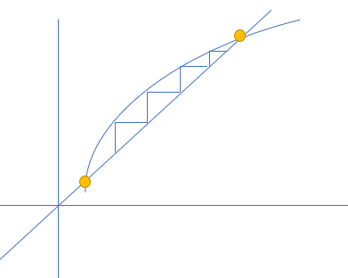

# 22. 对角化和矩阵幂

## 1. 对角化

### i. 对角化的实质

对于一个有 $n$ 个不同特征值的方阵 $A$, 如果将其 $n$ 个特征值对应的特征向量放到矩阵 $S$ 中，可以有：

$$
AS = A
\begin{bmatrix}
x_1 & x_2 & \cdots & x_n
\end{bmatrix} =
\begin{bmatrix}
Ax_1 & Ax_2 & \cdots & Ax_n
\end{bmatrix}
$$

$$
原式 =
\begin{bmatrix}
\lambda_1x_1 & \lambda_2x_2 & \cdots & \lambda_nx_n
\end{bmatrix} =
\begin{bmatrix}
x_1 & x_2 & \cdots & x_n
\end{bmatrix}
\begin{bmatrix}
\lambda_1 & 0 & \cdots & 0 \\
0 & \lambda_2 & \cdots & 0 \\
\vdots & \vdots & \ddots & \vdots \\
0 & 0 & \cdots & \lambda_n \\
\end{bmatrix}
$$

实际上 $AS = S\Lambda$
如果左侧再乘上一个 $S^{-1}$, 就等同于消去左侧的 $S$, 得到对角矩阵的计算公式 / 方阵 $A$ 的分解公式：

$$
\Lambda = S^{-1}AS, \qquad A = S \Lambda S^{-1}
$$

### ii. n 次幂与特征值

#### a. 矩阵角度

还记得前面有类似结构的矩阵，只是类似，并不是完全等同，那便是投影矩阵 $P = A(A^TA)^{-1}A^T$, 其中有一性质：$P^{k} = P$。

关于对角矩阵 $\Lambda$，有：

$$
\Lambda^{k} = S^{-1}AS \cdots S^{-1}AS =S^{-1}(S^{-1}(\cdots(A^k)\cdots)S)S = S^{-1}A^kS
$$

#### b. 特征值角度

对于 $\Lambda^k = S^{-1}A^kS$, 究其本质，是矩阵 **$A^n$ 与 $A$** 之间**特征向量和特征值的关系**作用。

$$
\because Ax = \lambda x
\qquad
\therefore A^2x = A\lambda x = \lambda Ax = \lambda^2 x
$$

这也就是说明，$A^k x = \lambda^k x$, 根据特征值的定义，**$A^n$ 的特征值为 $\lambda^n$**，但是 **特征向量却没有变** 。

#### c. 对角矩阵幂

一个对角矩阵 $\Lambda$, 由矩阵乘法可得：

$$
\Lambda =
\begin{bmatrix}
\lambda_1 & 0 & \cdots & 0 \\
0 & \lambda_2 & \cdots & 0 \\
\vdots & \vdots & \ddots & \vdots \\
0 & 0 & \cdots & \lambda_n \\
\end{bmatrix},
\qquad
\Lambda^k =
\begin{bmatrix}
\lambda_1^k & 0 & \cdots & 0 \\
0 & \lambda_2^k & \cdots & 0 \\
\vdots & \vdots & \ddots & \vdots \\
0 & 0 & \cdots & \lambda_n^k \\
\end{bmatrix}
$$

#### d. 方阵稳定

稳定这个概念我认为或许来自于 **不动点**。



比如有一个数列 $a_n = f(a_{n-1})$， 如果 **函数满足某些条件**，那么会有：

$$
\lim_{n \to +\infty}a_n = a_{n-1}
$$

对于 **可对角化的矩阵** 也是如此，如果把矩阵变换看作一个函数，那么也应该在 **变换满足某些条件** 时有：

$$
\lim_{k \to +\infty}A^{k} = A^{k-1}
$$

我们可以推导这个所谓的条件：

$$
A^k = S^{-1} \Lambda^k S
$$

两边取行列式，由行列式 **性质九的推论 和 性质七**：

$$
det\ A^k = det\ S^{-1} det\ \Lambda^k det\ S = det\ \Lambda^k = \prod_{i=0}^{n}\lambda_i^k
$$

那么不难想到，如果 $\prod_{i=0}^{n}\lambda_i^k = 0$，方阵就稳定了。
所以得到等价条件：

$$
\prod_{i=0}^{n}|\lambda_i| \in (0, 1)
$$

### iii. 对角化的条件

因为上面，我们的前提一直是：

```22
对于一个有 n 个不同特征值的方阵 A。
将其 n 个特征值对应的特征向量放到一矩阵中，这个矩阵称作 S。
```

所以我们能够确定的是：**只要有 n 个不同的特征值的方阵一定可以被对角化**。

但是这是矩阵对角化的充要条件吗？
很明显不是。

其实矩阵被对角化的充要条件由上面的证明已经显而易见了：

**只要方阵有 n 个线性无关的特征向量，那么其一定可以被对角化**。

而 **有 n 个不同的特征值** 只是 **有 n 个线性无关的特征向量** 的一个充分条件而已。
在上一节的结尾提过：只要特征多项式的每个特征值的 **代数重数 = 几何重数**，那么也是可以被对角化的。（因为零空间维数没那么大的话，即使是相同的 $n$ 个特征值，也可能表示 $n$ 维空间）

比如类似上一节结尾处提及的矩阵：

$$
A =
\begin{bmatrix}
2 & 1 \\
0 & 2 \\
\end{bmatrix}
$$

特征多项式 $|A-\lambda I| = (2- \lambda)^2$，解得：

$$
\lambda_1 = \lambda_2 = 2
$$

但是两个相同的特征值在这个矩阵当中找不到两个线性无关的特征向量。
所以这个矩阵可以说不能被写成 $S^{-1}AS$。
（但是说它可以通过行变换变成对角矩阵吗？因为其有两个非零特征值，所以这个矩阵可以，但只是不能写成上面的那个形式。）

## 2. 矩阵幂

### i. 差分方程

对于递推表达式：$u_{k+1} = Au_k, (k = 0, 1, 2, \cdots)$，给定初值 $u_0$，那么就有通项公式：$u_{k} = A^ku_0$

假设 $A$ 拥有 $n$ 个线性无关的特征向量 $x_i, (i = 1, 2, \cdots, n)$，$u_0$ 可被表达为：

$$
u_0 = c_1x_1 + c_2x_2 + \cdots + c_nx_n
$$

$$
u_1 = Au_0 = c_1Ax_1 + c_2Ax_2 + \cdots + c_nAx_n = c_1\lambda_1x_1 + c_2\lambda_2x_2 + \cdots + c_n\lambda_nx_n
$$

$$
u_{100} = c_1\lambda_1^{100}x_1 + c_2\lambda_2^{100}x_2 + \cdots + c_n\lambda_n^{100}x_n
$$

如果写成矩阵形式，那么可以用以下通项：

$$
u_0 = SC, \qquad
u_k = S \Lambda^k S^{-1} u_0 = S \Lambda^k C
$$

### ii. 斐波拉契数列

设数列 0, 1, 1, 2, 3, 5, 8...
对于斐波拉契数列，都有 $F_{n+2} = F_{n+1} + F_{n}$。
如果我们把斐波拉契数列，$F_{n+1} = AF_n$，那么就可以
如果把差分式写作：

$$
u_k =
\begin{bmatrix}
F_{k+1} \\
\\
F_k \\
\end{bmatrix},
u_{k+1} = Au_k =
\begin{bmatrix}
1 & 1 \\
\\
1 & 0 \\
\end{bmatrix}
\begin{bmatrix}
F_{k+1} \\
\\
F_k \\
\end{bmatrix} =
\begin{bmatrix}
F_{k+2} \\
\\
F_{k+1} \\
\end{bmatrix}
$$

$$
\begin{cases}
F_{k+2} = F_{k+1} + F_{k} \\
\\
F_{k+1} = F_{k+1} \\
\end{cases}
$$

对于这个递推矩阵，它巧妙地把一个二阶差分式变为一阶关系。
立刻求这个方阵 $A$ 的特征值和特征向量：

#### a. 特征值

$$
|A - \lambda I| =
\begin{vmatrix}
1-\lambda & 1 \\
1 & -\lambda \\
\end{vmatrix} = \lambda^2 - \lambda - 1
$$

可能我们不知道这个特征多项式有什么用，但这个令其等于 0，就是特征方程（本征方程）。
表示上述斐波拉契数列递推式转化为：$A^2F_n = AF_n + F_n \Rightarrow A^2 - A - E = 0$

所以得到特征值：

$$
\lambda_1 = \frac{1+\sqrt{5}}{2} \approx 1.618, \quad \lambda_2 = \frac{1-\sqrt{5}}{2} \approx 0.618
$$

回顾前面的式子：$u_k = S \Lambda^k C$

上式：

$$
u_{k} = c_1\lambda_1^{k}x_1 + c_2\lambda_2^{k}x_2 + \cdots + c_n\lambda_n^{k}x_n
$$

但是对于这个斐波那契数列来说，特征值只有两个，一个大于 1 ，一个小于 1 。
我们知道，越到后面，大于 1 的特征值会显现它的作用，而小于 1 的则会越来越微弱。
数列的增长取决于那个大的特征值。

即使有一个数列它的两个甚至多个特征值，由极限理论，那也是取决于最大的那个。

#### b. 特征向量

因为：

$$
A-\lambda I =
\begin{bmatrix}
1-\lambda & 1 \\
1 & -\lambda \\
\end{bmatrix}
\begin{bmatrix}
\lambda \\
1 \\
\end{bmatrix} = O
$$

所以对应的特征向量是：

$$
x_1 =
\begin{bmatrix}
\lambda_1 \\
1 \\
\end{bmatrix}, \quad
x_2 =
\begin{bmatrix}
\lambda_2 \\
1 \\
\end{bmatrix}
$$

而 $u_0 = (1, 0)^T$,

所以通项公式为：

$$
u_k = c_1\lambda_1^{k}x_1 + c_2\lambda_2^{k}x_2
$$

我们目前要求解的是两个常数 $c_1, c_2$，代入 $u_0$ 就可以求解，最后得到：

$$
u_k =
\begin{bmatrix}
\dfrac{1}{\sqrt{5}}((\dfrac{1+\sqrt{5}}{2})^{n+1} - (\dfrac{1-\sqrt{5}}{2})^{n+1}) \\
\\
\dfrac{1}{\sqrt{5}}((\dfrac{1+\sqrt{5}}{2})^{n} - (\dfrac{1-\sqrt{5}}{2})^{n}) \\
\end{bmatrix}
$$

对于一个不断增长，但增长率变化的数列，我们可以用 **矩阵** 来描述 **相邻两项**，那么可以 **通过递推式** 得出转移矩阵。
通过 **特征值** 和 **极限**，我们知道了数列的增长状况；通过 **特征向量和初始条件**，并且利用 **对角矩阵分解**， 我们知道了差分式的结果。

这就是高中利用特征方程法求解斐波那契数列的本质。
