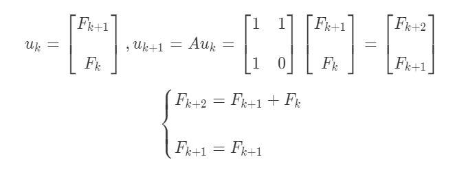

# 23. 微分方程和exp(At)

## 1. 微分方程

### i. 引子

微分方程中，不仅仅有未知数，更有 关于未知数的函数 以及 函数导数。
学过高数的都知道，微分方程的解常常不是一个值，而是一个或者一系列函数。

微分方程又分作 常微分方程 和 偏微分方程 。
常微分方程（ODE）一般可以表示为：

$$
f(x, y, \dfrac{dy}{dx}, \cdots, \dfrac{d^ny}{dx^n}) = 0
$$

在这里，线性代数比较好解释的方程形式为：**一阶非齐次常系数线性微分方程组**。

### ii. 表示

#### a. 差分方程与微分方程

对于一个特殊的一阶非齐次常系数线性微分方程组：

$$
\begin{cases}
\dfrac{du_1}{dt} = -u_1 + 2u_2 \\
\\
\dfrac{du_2}{dt} = u_1 - 2u_2 \\
\end{cases}
$$

先不管等式左侧，等式右侧，可以用矩阵乘法表示出来：

$$
AU =
\begin{bmatrix}
-1 & 2 \\
1 & -2 \\
\end{bmatrix}
\begin{bmatrix}
u_1 \\
u_2 \\
\end{bmatrix}, \quad
U(t = 0) =
\begin{bmatrix}
1 \\
0 \\
\end{bmatrix}
$$

然后我们从一开始，也就是时间 $t$ 刚刚从 0 开始时，那一瞬间进行分析，可以得到：

$$
\begin{cases}
\lim_{t \to 0^+}\dfrac{du_1}{dt} = -1 \\
\\
\lim_{t \to 0^+}\dfrac{du_2}{dt} = 1 \\
\end{cases}
$$

说明开始过后的一段时间， $u_1$ 会减少，而 $u_2$ 会增加。
（$\exists t_0 > 0,\ t \in (0, t_0)$）
（根据 **极限的局部保号性**）
（当 $\lim_{t \to 0^+}D > 0$， 在 $t$ 所在的空心邻域 $(0, t_0)$，恒有 $D > 0$）

前一节，我们通过转移矩阵的 **特征值** 和 **特征向量** 追踪了斐波那契数列 **差分式$u_k$** 的变化趋势。

我们可以看到，在这里，本质是一样的：

```23
对于上一节，我们利用 矩阵 将 高阶递推关系式 转化为了 差分式。

那么在这一节，我们还会利用矩阵 将 多个因变量的关系 转化为 单个自变量的变化趋势，即：du/dt
```



这是上一节课的精髓部分，也是理解这节课开场教授的话的关键。
对比：

$$
Au =
\begin{bmatrix}
-1 & 2 \\
1 & -2 \\
\end{bmatrix}
\begin{bmatrix}
u_1 \\
u_2 \\
\end{bmatrix}, \quad
u(t = 0) =
\begin{bmatrix}
1 \\
0 \\
\end{bmatrix}
$$

差分等式中的 $A$ 就是此处的 $A$, 差分等式中的 $u_k$ 就是此处的 $U$。
<!--> TODO: <--->

#### b. 求解特征值和特征向量

对于矩阵 $A$，参照上一节求解差分方程时的做法，我们应该首先求出其 **特征值和特征向量** ，只要这两个东西满足我们的要求。

观察 $A$, 可知：$det\ A = 0$，所以根据 **特征多项式的性质**，得知必有一特征值为 0。

又由 **矩阵迹与特征值的关系**，2 阶矩阵另外一个特征值必定为 -3。

所以根本不需要计算特征多项式，轻松得到：

$$
\lambda_1 = -3, \qquad \lambda_2 = 0
$$

就像上一节，我们把特征值看作变化率，那么教授猜测在结果当中，一定会有 $\exp(-3t), \exp(0t)$ 这两项。
**前者随着时间的推移**逐渐不对因变量的变化起作用，而**后者表示该微分方程将趋于稳态**。
（因为 0 作为变化率，代表不再变化）

当特征值为 0 时，明显看出第二列是第一列的 -2 倍。
所以特征向量之一 $x_2 = (2, 1)^T$

当特征值为 -3 时，心算得到矩阵 $A + 3I$ 两列相同。
所以另外一个特征向量 $x_1 = (1, -1)^T$

$$
x_1 = (1, -1)^T, \qquad x_2 = (2, 1)^T
$$

（这里两个特征向量不正交，那是因为矩阵 $A$ 不是实对称阵。**只有实对称阵的特征向量才两两正交**，**非实对称阵的特征向量**只是**线性无关**而已。）

#### c. 猜猜看

##### α. 方程解的形式

对于这个微分方程组，我们应该先根据上一节的 **差分方程解** 设出最终解的样子：

$$
u(t) = c_1e^{\lambda_1t}x_1 + c_2e^{\lambda_2t}x_2
$$

其中，$\lambda_i$ 为特征值，$x_i$ 为特征向量，$c_i$ 为一些系数（coefficient）
可以用矩阵表示为：（**为什么会这样设，下面有说明**）

$$
u(t) =
\begin{bmatrix}
x_1 & x_2 \\
\end{bmatrix}
\begin{bmatrix}
c_1e^{\lambda_1t} \\
\\
c_2e^{\lambda_2t} \\
\end{bmatrix}
= SV
$$

为了解释 **解** 的确就是这个形式，只需要对两遍微分：

$$
\dfrac{du}{dt} = c_1\lambda_1e^{\lambda_1t}x_1 + c_2\lambda_2e^{\lambda_2t}x_2 = c_1e^{\lambda_1t}Ax_1 + c_2e^{\lambda_2t}A x_2
$$

在这里：$e^{\lambda_1t}x_1, e^{\lambda_2t}x_2$ 这类式子，形式上和之前小节的 $\lambda_1^nx_1, \lambda_2^nx_2$ 没差的。都只是解的一种表示方式而已。

```23
纯指数形式的纯解，只是纯幂次形式解在微分方程中的类似体。
纯指数形式之于微分方程，正如纯幂次形式之于差分方程。
```

##### β. 解方程的原理

此外，还可以看出微分方程组解相较于原方程组之间的不同之处：
在原方程组中，位于右侧的因变量 **耦合** 在一起，即：**多个不同的因变量相互作用**。具体体现在 $u_1$ 的增长**由 $u_1, u_2$ 同时决定**。
而在方程组解中，没有一项同时包含 **特征值 $\lambda_1, \lambda_2$**。这就做到了 **解耦**。
正是 **特征值和特征向量** 的性质，（**实际是特征向量组能使矩阵对角化**）使之对角化，使解可以被写成 $S,\Lambda$ 共同表达的形式，来实现解耦。

即使不是微分方程组，而是普通的二元一次方程组，也需要利用代入或者消元的方法，对方程组解耦。不然不会有那么聪明永远可以一眼看出解的人的。

#### d. 继续求解

将特征值，特征向量代入解的形式：

$$
u(t) = c_1
\begin{bmatrix}
2 \\
1 \\
\end{bmatrix} + c_2 e^{-3t}
\begin{bmatrix}
1 \\
-1 \\
\end{bmatrix}
$$

剩下的，只需要求系数就够了，代入初始条件：

$$
u(0) = c_1
\begin{bmatrix}
2 \\
1 \\
\end{bmatrix} + c_2
\begin{bmatrix}
1 \\
-1 \\
\end{bmatrix} =
\begin{bmatrix}
1 \\
0 \\
\end{bmatrix}
$$

自然解得：

$$
\begin{cases}
c_1 = \dfrac{1}{3} \\
\\
c_2 = \dfrac{1}{3} \\
\end{cases}
$$

$$
u(t) = \dfrac{1}{3}
\begin{bmatrix}
2 \\
1 \\
\end{bmatrix} + \dfrac{1}{3} e^{-3t}
\begin{bmatrix}
1 \\
-1 \\
\end{bmatrix}
$$

当 $t \to +\infty, u(t) = (\dfrac{2}{3}, \dfrac{1}{3})^T$。

### iii. 微分方程的稳态

对于这个列子，当时间趋向无穷的时候，会有一个稳态。
但是并不是一切微分方程都有稳态。或许它们会在无穷时以极快的速度增长 / 减少。

那么达到稳态一定有它的条件：

1. 当 $t \to +\infty,\ \dfrac{du}{dt} \to 0$
    观察上面的微分式，由于 $c, A, x$ （常数、转移矩阵、特征向量）都是确定的，只有 $e^{\lambda t}$ 可能趋向于 0。
    所以达到稳态的条件就是 $\lambda < 0$
2. 等价于：$\exists \lambda_i = 0,\ while\ Re(\lambda_{else}) < 0$。
3. 不存在稳态当且仅当 $\exists i,\ st.Re(\lambda_i) > 0$。

#### a. 复数特征值

当然正如教授所说，并不是什么时候 $\lambda$ 都是实数，有可能为 **复数**。
但是由欧拉公式：

$$
e^{(a+bi)x} = (cos(bx) + isin(bx)) e^{ax}
$$

如果 $\lambda = a + bi$，那么也可以分离出虚数部分。
但是：

$$
|e^{bix}| = \sqrt{(cos(bx) + isin(bx))(cos(bx) - isin(bx))} = 1
$$

所以对方程是否达到稳态 **取决定性作用** 的只有 **特征值实数部分**。

#### b. 如何快速判断 —— 二阶

对于一个方阵 $A$，可以利用其 **特征多项式的性质** 快速求解，由上一节的内容：

$$
\begin{cases}
Tr(A) = \sum_{i=0}^{n}\lambda_i \\
\\
det\ A = \prod_{i=0}^{n}\lambda_i \\
\end{cases}
$$

对于 2 阶方阵 $A$：

$$
A =
\begin{bmatrix}
a & b \\
c & d \\
\end{bmatrix}
$$

当且仅当：（类似根据韦达定理判断根的正负性）

$$
\begin{cases}
a + d = \lambda_1 + \lambda_2 < 0\\
\\
ad - bc = \lambda_1 \lambda_2 > 0\\
\end{cases}
$$

#### iv. 微分方程组解的核心

对于例子的微分方程组，可以写作：

$$
\dfrac{du}{dt} = Au
$$

此处，$A$ 是转移矩阵，也是方程组耦合的根源，我们要做的就是将方阵 $A$ 进行 **某种变化** ，使方程组解耦。
而 $u$ 不是单个变量，而是变量组成的向量。

根据 （iii.a.）中的方程组的解的形式：

$$
u(t) = c_1e^{\lambda_1t}x_1 + c_2e^{\lambda_2t}x_2
$$

现在设这两个矩阵：

$$
S =
\begin{bmatrix}
x_1 & x_2 \\
\end{bmatrix},
\qquad
V =
\begin{bmatrix}
c_1e^{\lambda_1t} \\
\\
c_2e^{\lambda_2t} \\
\end{bmatrix},
$$

那么方程组的解可以被表示为： $u = Sv$。
代入矩阵方程中，得到：

$$
\dfrac{du}{dt} = \dfrac{d(Sv)}{dt} = S\ \dfrac{dv}{dt}
$$

因为：

$$
\dfrac{du}{dt} = Au = ASv
$$

所以：

$$
S\ \dfrac{dv}{dt} = ASv
$$

我们知道，这个矩阵 $S$ 其实就是特征向量组，而如果矩阵 $A$ 是可以被对角化的，那么我在等式两边都左乘矩阵 $S^{-1}$ 的话，可以有：$S^{-1}AS = \Lambda$，那么：

$$
\dfrac{dv}{dt} = \Lambda v
$$

（为什么这里变成了 $\dfrac{dv}{dt}$，而不是之前的 $\dfrac{du}{dt}$，就是因为等式右侧的因变量发生了变化：$u \to c_i e^{\lambda_i t}$）

如果方程组可以被这样表示，（指右端为对角阵）
那么就可以说实现了 **解耦**。（因为 **展开后** 每一个方程 $v$ 中的 **因变量 $v_i$** 只对应 **$\Lambda$ 对角线上的一个元素 $\lambda_i$**）

```23
换了一个因变量
就是换了一个方程组

而新的方程组
可以使得
每一个方程
都只含有
一个因变量
```

还记得教授说过：纯指数形式的纯解，只是纯幂次形式解在微分方程中的类似体。

由于每个方程都只对应一个新的因变量，所以可以写出新因变量 $v$ 的通解形式：

$$
v(t) = e^{\Lambda t} v(0)
$$

（因为解耦过，所以不会有其他项）

## 2. 矩阵幂

好了，现在终于到了本节的第二小节。
可以看到上面这个式子出现了之前我们从来没有见过的符号：

$$
e^{\Lambda t}
$$

看起来，这个把矩阵放到了指数的地方的式子很不好理解。（实际上如果是一个一般方阵，要直接写出矩阵指数的结果是挺困难的一件事，但是 **对角矩阵不一样**）

### a. 泰勒展开

具体计算可以利用 **指数的展开**，在这里刚好是 $e$ 作底，所以直接写成：

$$
e^{At} = \sum_{k = 0}^{n} \dfrac{(At)^k}{k!} = I + At + \dfrac{(At)^2}{2} + \cdots + \dfrac{(At)^n}{n!}
$$

这是因为对于 $e^x$ 有展开式：

$$
e^x = \sum_{k = 0}^{n} \dfrac{x^k}{k!} = 1 + x + \dfrac{x^2}{2} + \cdots + \dfrac{x^n}{n!}
$$

同理：

$$
\dfrac{1}{1-x} = \sum_{k = 0}^{n}{x^k} = 1 + x + x^2 + \cdots + x^n
$$

所以：

$$
(I - At)^{-1} = \sum_{k = 0}^{n} (At)^k = I + At + (At)^2 + \cdots + (At)^n
$$

###　b. 解的处理

上面说过，方程组的解可以表示成：$u = Sv$，而特征向量组肯定可逆。
（ **原因是假设过 $S$ 中的 $n$ 个列向量线性无关**，所以列空间维数 = $n$，进而推出满秩和可逆）
所以反解出：$v = S^{-1}u$

既然对通解都有以上成立，那么特解肯定也是可以的：$v(0) = S^{-1}u(0)$，所以：

$$
S^{-1}u(t) = e^{\Lambda t} S^{-1}u(0)
$$

左右同乘 $S$ 后：

$$
u(t) = S e^{\Lambda t} S^{-1}u(0)
$$

由上面关于 $e^{\Lambda t}$ 的展开，我们可以进行矩阵乘法：

$$
S e^{\Lambda t} S^{-1}= \sum_{k = 0}^{n} \dfrac{S (\Lambda t)^k S^{-1}}{k!}
$$

$t$ 是因变量，是个常数，所以直接提到外面去没问题。而矩阵 $S$ 是特征向量矩阵，不是随 $k$ 变化的，所以也可以乘进去。因此：

$$
原式 = SS^{-1} + S \Lambda S^{-1}t + \dfrac{S \Lambda^2 S^{-1}t^2}{2} + \cdots + \dfrac{S \Lambda^n S^{-1}t^n}{n!}
$$

由于 $A = S \Lambda S^{-1}$，

$$
原式 = I + At + \dfrac{(At)^2}{2} + \cdots + \dfrac{(At)^n}{n!} = e^{At}
$$

因此：$u(t) = e^{At}u(0)$。

### c. 2 阶微分方程

对于 2 阶微分方程：

$$
y^{(2)} + ay^{(1)} + by = 0
$$

仿照上一节差分方程的方式，我们可以写出 $y^{(2)}, y^{(1)}$ 差分式之间的转移关系：

令 $u = \begin{bmatrix} y^{(1)} \\ \\  y \end{bmatrix}$, 则对其微分：$u' = \begin{bmatrix} y^{(2)} \\ \\  y^{(1)} \end{bmatrix}$

$$
u' =
\begin{bmatrix}
-a & -b \\
\\
1 & 0 \\
\end{bmatrix}
u
$$

所以一个 2 阶微分方程，就被转化成了一个 1 阶微分线性方程组。（通过一个 2 阶矩阵）

### d. n 阶微分方程

那么对于更高阶的微分方程，可不可以用这种手段转化呢？
至于可行性我们可以这么考虑：**如果相邻阶数微分方程之间的转化**，不需要 **外部增补的方程**，那么就可以做到。

所以明显，可以把一个 $n$ 阶方程，最终转化为一个 $n$ 阶矩阵为转移矩阵的 1 阶微分方程组。

正如教授所说，对于 $n$ 阶微分方程：$y^{(n)} + a_1y^{(n-1)} + \cdots + a_n y = 0$ 其转移方阵大概类似下面的矩阵：

$$
\begin{bmatrix}
-a_1 & -a_2 & \cdots & a_{n-1} & a_n \\
1 & \ddots &  &  & \vdots \\
0 & 1 & \ddots &  & \vdots \\
 & 0 & 1 & \ddots & \vdots \\
 &  & 0 & \ddots & \vdots\\
 &  &  & 0 & 1 \\
\end{bmatrix}
$$

其中 1 表示“本身”，0 表示“不需要”，其余数字表示“系数”。
