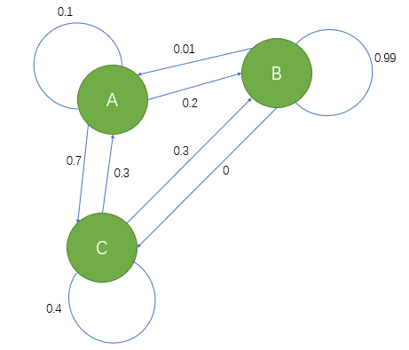

# 24. 马尔可夫矩阵和傅里叶级数

## 1. 马尔可夫矩阵

### i. 马尔可夫链

个人认为，马尔可夫矩阵其实是马尔科夫链的一种表示形式。

比如说，我家只有三个房间：厨房，厕所，卧室。

* 如果我在厨房，那么我 **一个小时** 之后还在厨房的概率是 0.1，跑到厕所的概率是 0.2，回到卧室的概率是 0.7；
* 如果我在厕所，那么我 **一个小时** 之后还在厕所的概率是 0.99，去厨房的概率是 0.01，回到卧室的概率是 0；
* 如果我在卧室，那么我 **一个小时** 之后还在卧室的概率是 0.4，去厨房的概率是 0.3，跑到厕所的概率是 0.3。

读过上述一系列事件用图的方式表现出来，就好似上面这个图。
现在这里有三个房间依次对应 $A, B, C$。

我们可以看出这个图还算是比较特别。

1. 首先，我不会到了一个房间就自闭，再也不出来。任何一个房间都不会将我禁锢 **（吸收）** 在那个房间中。
2. 其次，任意一个时刻，我 **下一个小时** 要去的房间 **概率** 仅仅与 **当前** 所在房间有关；**而与之前我到过的房间（历史状态）无关** 。
3. 再次，只要时间无穷，我肯定去过 **（可达）** 所有的房间。
4. 再者，我的运动很随意。起点一定，任意一个时刻我可能在任意一个房间 **（无周期性）**。
5. ……

### ii. 马尔可夫链对应的矩阵

如果把三个房间抽象为 **“状态”**，并由矩阵描述状态的转移，那么可以得到如下矩阵：

$$
A =
\begin{bmatrix}
0.1 & 0.01 & 0.3 \\
0.2 & 0.99 & 0.3 \\
0.7 & 0 & 0.4 \\
\end{bmatrix}
$$

由于这些元素都是概率，所以我们由 **概率的非负性、规范性**，有这样的矩阵特性：

$$
\begin{cases}
a_{ij} = P(j | i) > 0 \\
\\
\sum_{i = 1}^{n} a_{ij} = \sum_{i = 1}^{n} P(j | i) =1
\end{cases}
$$

（事实上，马尔可夫矩阵的幂还是马尔可夫矩阵，因为满足这两个概率相关的性质。）

### iii. 马尔可夫矩阵的稳态

#### a. 稳态的对应

上一节提过微分方程的稳态。
在那里，具体表现为方程组左侧的微分式：$\dfrac{du}{dt} = 0$ 在 $t \to +\infty$ 时恒成立，因为这代表着函数图像趋于平稳。
而实际上，我们可以将这种稳态转化为：$\lim_{t \to +\infty} u(t) = C$, 而这对应矩阵的平衡状态，对应着矩阵的特征值或许有一个 为 0，其余为负数。

一旦领会了微分方程稳态可以表示为 矩阵稳态。
那么马尔可夫链既然：

1. 可以被表示为马尔可夫矩阵；
2. 马尔可夫矩阵的幂也是马尔可夫矩阵。

那么就有理由怀疑其也有稳态，并且稳态也可以用矩阵来表示。

#### b. 稳态的条件

其实这是可以的。
重点关注 **“马尔可夫矩阵的幂也是马尔可夫矩阵”** 这句话。
我们天才地联想到，好像以前有一类矩阵拥有类似性质 —— 投影矩阵 $P$（$P = P^2 = \cdots = P^n$）
投影矩阵达到了稳态。
我们现在只需要：$A^k = A^{k-1}$ 就可以令马尔可夫矩阵达到稳态。

我们再次天才地联想到这或许和 **特征值和特征向量** 的概念挂钩：$Ax = \lambda x$

如果存在一个方阵 $A$，其存在一个特征值 $\lambda = 1$，同时这个特征值对应的特征向量刚好为自身，那么就有：$A \times A = A$。

还记得差分方程那一讲中，解的通项： **$u_k = A^k u_0$**，如果将其展开写作多项式，就有：

$$
u_{k} = c_1\lambda_1^{k}x_1 + c_2\lambda_2^{k}x_2 + \cdots + c_n\lambda_n^{k}x_n
$$

不妨设特征值的绝对值降序排列：$\lambda_1 > \lambda_2 > \cdots > \lambda_n$。
如果存在一个 $|\lambda_m| > 1$，那么解就是不稳定的。
可如果 $|\lambda_1| < 1$，那么在 $k \to +\infty$ 时，解 **（这是一个差分式，不是微分式）** 一定趋近于 0，那么因变量一定是处于稳态中。

#### c. 事实与理论的重合：lambda = 1

但是事实上，**只要是个马尔可夫矩阵，它一定有一个特征值为 1** 。
下面进行一下验证，我们还是用之前的 “厨房-厕所-卧室 转移矩阵” $A$：

$$
A =
\begin{bmatrix}
0.1 & 0.01 & 0.3 \\
0.2 & 0.99 & 0.3 \\
0.7 & 0 & 0.4 \\
\end{bmatrix}
$$

不妨设存在一特征值为 1，那么计算相应的特征多项式 $|A-I|$：

$$
|A - I|=
\begin{vmatrix}
-0.9 & 0.01 & 0.3 \\
0.2 & -0.01 & 0.3 \\
0.7 & 0 & -0.6 \\
\end{vmatrix}
$$

但我不用算就可以知道这个行列式值为 0。

原本 **马尔可夫矩阵的性质** 就是 **任意一列列和为 1** ，现在我在对角线元素上都减了 1，也就意味着 **每一列列和被减了 1** 。

所以只要把所有的行都加到任意的第 $k$ 行，那么第 $k$ 行就是全零行了。
由 **行列式性质六**，行列式为 0。

或者构造列向量 $x = (1, 1, 1)^T$，该向量位于矩阵 $A - I$ 转置的零空间中 —— $x\  in\ N((A - I)^T) \Rightarrow x \perp C(A - I)$，所以行向量线性相关。

这里教授提到了一个小知识点：$A$ 的特征值与 $A^T$ 的特征值完全相同。
（因为 **行列式性质十**，$det(A - \lambda I) = det((A - \lambda I)^T) = det(A^T - \lambda I)$）

### iv. 马尔可夫矩阵的应用 —— 人口迁徙

教授假设加州和麻省的人数为 $u_{cal}, u_{mass}$， 并且假定状态转移方阵为 $A$，那么有 $u_k = Au_{k-1}$，并且 $A$ 表示：

$$
A =
\begin{bmatrix}
麻省人决定留在麻省 & 加州人决定前往麻省 \\
\\
麻省人决定前往加州 & 加州人决定留在加州 \\
\end{bmatrix}
$$

随便给 $A$ 填一点值：

$$
\begin{bmatrix}
u_{cal} \\
u_{mass} \\
\end{bmatrix}_{t = k+1} =
\begin{bmatrix}
0.9 & 0.2 \\
0.1 & 0.8 \\
\end{bmatrix}
\begin{bmatrix}
u_{cal} \\
u_{mass} \\
\end{bmatrix}_{t = k}
$$

假设：

$$
\begin{bmatrix}
u_{cal} \\
u_{mass} \\
\end{bmatrix}_{t = 0} =
\begin{bmatrix}
0 \\
100 \\
\end{bmatrix}
$$

如果每一年进行一次人口迁移，那么第一年过后：

$$
\begin{bmatrix}
u_{cal} \\
u_{mass} \\
\end{bmatrix}_{t = 1} =
\begin{bmatrix}
20 \\
80 \\
\end{bmatrix}
$$

现在我们如果来考察 10000 年过后，那就不得不考虑 **特征值和特征向量**：
由 **马尔可夫矩阵的性质** 和 **矩阵迹与特征值和** 的关系，得到：

$$
\lambda_1 = 1, \qquad \lambda_2 = 0.7
$$

前者十分重要，而后者可以略去。
对于特征值为 1 时，其特征向量解得为：

$$
x_1 = (2, 1)^T,\qquad x_2 = (1, -1)^T
$$

特征向量组成的矩阵记作 $S$，那么一定可以有对角矩阵 $A = S \Lambda S^{-1}$

所以：

$$
\begin{bmatrix}
u_{cal} \\
u_{mass} \\
\end{bmatrix}_{t = k} =
S \Lambda^k S^{-1}
\begin{bmatrix}
u_{cal} \\
u_{mass} \\
\end{bmatrix}_{t = 0}
$$

由题：

$$
\Lambda^k =
\begin{bmatrix}
1 & 0 \\
0 & 0 \\
\end{bmatrix} \quad (k \to +\infty)
$$

经过简单计算：

$$
\begin{bmatrix}
u_{cal} \\
u_{mass} \\
\end{bmatrix}_{t = k} =
\dfrac{1}{3}
\begin{bmatrix}
-2 & 2 \\
-1 & 1 \\
\end{bmatrix}
\begin{bmatrix}
u_{cal} \\
u_{mass} \\
\end{bmatrix}_{t = 0}
$$

所以通过初始条件，就可以解出 10000 年之后两州的人数。

其实实际上也不需要计算，**因为稳态一定决定于 特征值 1 对应的特征向量** 。

## 2. 傅里叶级数

### i. 向正交基投影

对于一组 **正交基**，其空间中任何的向量都可以被其线性表示。
将任意 $n$ 维向量 $v$，用表示这 $n$ 维空间的一组正交基 $(q_1, q_2, \cdots, q_n)$ 表示，都有：

$$
v = \sum_{i = 1}^n x_iq_i, \quad (x_i = q_i^T v)
$$

根据上式，也很好推出括号中的条件：

$$
v = QX \quad \Leftrightarrow \quad X = Q^{-1}v = Q^T v \quad (Q 为正交矩阵)
$$

## ii. 函数内积

如果说，向量的正交指的是：$y^T x = 0$，利用了内积的性质。
那么 **函数内积** 也可以类似定义：$f^Tg = \int f(x)g(x)$

至于 **积分符号**，那是因为向量看似只是两个向量点乘，但是一个点乘下，有多个乘法需要计算：

$$
y^Tx = y_1x_1 + y_2x_2 + \cdots + y_nx_n
$$

**由离散到连续**，可以得知，如果想要定义函数内积，那么需要 **对于每一个自变量 $x$ 的取值都进行乘法运算**，最后 **求和**。

那么自然就引入了积分符号 $\int$。

### iii. 傅里叶展开

对于三角形式的傅里叶展开式（令 $\omega = 1$），有：

$$
f(x) = a_0 + a_1cosx + b_1sinx + \cdots + a_ncosnx + b_nsinnx
$$

如果把函数 $f(x)$ 比作一个向量，等号右侧的 $cosx, sinx, cosnx$ 之类的表达式就好似基。

**为了验证这个想法**，可以求一个积分式：$\int_0^{2 \pi} sin \alpha xcos \beta xdx$

这个积分式结果为 0。

这说明函数表达式中任何两个三角函数做内积，其结果都为 0，内积结果为 0，**好似它们就是正交一般**。

那么由 $X = Q^T v$ 的思想，可以 **求出傅里叶展开中的所有常数项**，比如：

$$
\int_0^{2 \pi} f(x)cosxdx = \int_0^{2 \pi} a_1 cos^2 xdx = 1
$$

所以 $a_1 = \dfrac{1}{\pi}$。
