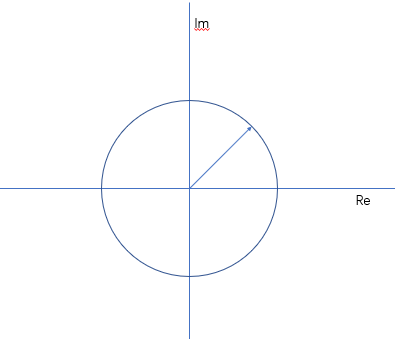
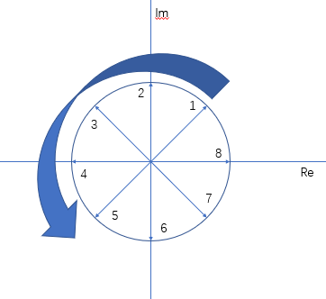

# 27. 复数矩阵和快速傅里叶变换

## 1. 复数矩阵

### i. 求模长

假设一个复列向量为 $z = \begin{bmatrix} z_1 & z_2 & \cdots & z_n \end{bmatrix}^T$，其中每一个元素都可以表示为：$z_i = a_i + b_i i$。

由前面两节的内容，我们知道利用简单的内积（$z^Tz$）是求不出复数向量的模长的。（$a_i^2 - b_i^2 \ne ||z_i||^2$）
但是可以通过左乘复列向量的 **共轭转置** 来得到模长：

$$
z =
\begin{bmatrix}
a_1 + b_1 i \\
a_2 + b_2 i \\
\vdots \\
a_n + b_n i \\
\end{bmatrix}
$$

其对应的共轭矩阵的转置为：

$$
\bar z^T =
\begin{bmatrix}
a_1 - b_1 i & a_2 - b_2 i & \cdots & a_n - b_n i
\end{bmatrix}
$$

由此可以得到：

$$
||z_i||^2 = \bar z^T z = z^Hz = \sum_{i = 1}^n (a_i^2 + b_i^2)
$$

（$H$ 是一种记号，来自于艾尔米特的首字母）

### ii. 其余一切性质

既然像第 26 节所讲的那样：艾尔米特矩阵也拥有 **$n$ 个实特征值以及 $n$ 个两两正交的特征向量**，那么这些性质也可以表示为：

$$
A^H = A
$$

对于两两正交的向量（$q_1, q_2, \cdots, q_n$），有：

$$
q_i^H q_j =
\begin{cases}
0 \quad if\ i \ne j \\
1 \quad if\ i = j
\end{cases}
$$

**两两正交** 是以下结论的源头：

$$
Q^H Q = I, \quad (Q = \begin{bmatrix} q_1, q_2, \cdots, q_n \end{bmatrix})
$$

因此艾尔米特矩阵可以被分解为：

$$
A = Q^{-1} \Lambda Q = Q^H \Lambda Q
$$

## 2. 傅里叶变换

### i. 傅里叶矩阵

在傅里叶矩阵中，不使用首行序号为 1 的约定，首行序号为 0。

$$
F_n =
\begin{bmatrix}
1 & 1 & 1 & \cdots & 1 \\
1 & \omega & \omega^2 & \cdots & \omega^{(n-1)} \\
\vdots & \vdots & \ddots & & \vdots \\
\vdots & \vdots & & \ddots & \vdots \\
1 & \omega^{(n-1)} & \cdots & \cdots & \omega^{(n-1)^2}
\end{bmatrix}
$$

这个矩阵是通过对称阵性质得出的。
对于矩阵中元素：$(F_n)_{ij} = \omega^{ij}$。

矩阵中的 $\omega$ 不是一般的常数，有其特定的取值：$\omega_n^n = 1$
在复数域中：

$$
\omega_n = e^{\dfrac{2 \pi i}{n}} = cos(\dfrac{2 \pi}{n}) + isin(\dfrac{2 \pi}{n})
$$

（至于为什么 $\omega^n = 1$ 在这个取值下成立，因为：$e^{\pi i} + 1 = 0$ 这个谁都知道的式子，所以自然有：$\omega_n^n = e^{2 \pi i} = 1$）
（像图中，就取了 $\dfrac{\pi}{4}$，$\omega_4 =  e^{\frac{\pi i}{4}}$， $n = 8$）

如果不信，可以算一步来求证一下：

$$
(e^{\frac{2 \pi i}{n}})(e^{-\frac{2 \pi i}{n}}) =
(cos(\dfrac{2 \pi}{n}) + isin(\dfrac{2 \pi}{n}))(cos(\dfrac{2 \pi}{n}) - isin(\dfrac{2 \pi}{n}))
$$

$$
原式 = cos^2(\dfrac{2 \pi}{n}) + sin^2(\dfrac{2 \pi}{n}) = 1
$$

（验证了一下原地 tp）

$$
(e^{\frac{2 \pi i}{n}})(e^{\frac{2 \pi i}{n}}) =
(cos(\dfrac{2 \pi}{n}) + isin(\dfrac{2 \pi}{n}))(cos(\dfrac{2 \pi}{n}) + isin(\dfrac{2 \pi}{n}))
$$

$$
原式 = cos^2(\dfrac{2 \pi}{n}) - sin^2(\dfrac{2 \pi}{n}) + 2isin(\dfrac{2 \pi}{n})cos(\dfrac{2 \pi}{n})= cos(\dfrac{4 \pi}{n}) + isin(\dfrac{4 \pi}{n})
$$

（这个是走了一步）
只要我们不停下脚步，道路就会继续延伸，直到再次回到起点：

（可以看到乘了一圈又乘回来了）

比较特别的，我们关注 $n = 4$，

$$
\omega_4^4 = 1
$$

解得：$\omega_4 = 1, i, -1, -i$。

对应的傅里叶矩阵为：

$$
F_4 =
\begin{bmatrix}
1 & 1 & 1 & 1 \\
1 & i & -1 & -i \\
1 & -1 & 1 & -1 \\
1 & -i & -1 & i \\
\end{bmatrix}
$$

### ii. 算法探索

无论是 4 阶的还是 $n$ 阶的，傅里叶矩阵都是正交矩阵。
如果不相信的话，就应该对傅里叶矩阵求逆，比如上面的 $F_4$，其对应逆矩阵应该是：

$$
F_4^{-1} =
\dfrac{1}{2}
\begin{bmatrix}
1 & 1 & 1 & 1 \\
1 & -i & -1 & i \\
1 & -1 & 1 & -1 \\
1 & i & -1 & -i \\
\end{bmatrix}
$$

（前面有系数的原因是：可以看到列向量模长不为 1）
但是也还能得出：

$$
2F_4^{-1} = F_4^H
$$

根据辐角和 $\omega$ （可以看成角速度来想）之间的关系，被分割的一份辐角越大，$\omega$ 越小。由计算 $\omega$ 的公式，可得：

$$
(\omega_k)^{\dfrac{k}{m}} = \omega_m
$$

比如 64 阶傅里叶矩阵和 32 阶傅里叶矩阵：

$$
(\omega_{64})^2 = \omega_{32}
$$

但是，64 阶矩阵有 64 行 64 列，32 阶矩阵只有 32 行 32 列。
不能说把 64 阶矩阵中的 $\omega$ 直接替换就完事儿了，需要进行变换：

$$
\begin{bmatrix}
& & \\
& F_{64} & \\
& & \\
\end{bmatrix} =
\begin{bmatrix}
& \\
& \\
& \\
\end{bmatrix}
\begin{bmatrix}
F_{32} & O\\
& \\
O & F_{32}\\
\end{bmatrix}
\begin{bmatrix}
& & \\
& & \\
& & \\
\end{bmatrix}
$$

如果直接计算 $F_{64}$ ，总共需要计算 $64^2$ 个元素，但是转换过后，在知道变换矩阵的前提下，计算 2 个 $F_{32}$ 只需要 $2 \times 32^2$ 个元素。

（当然，傅里叶变换和快速傅里叶变换我并没有任何了解。如果曾经学习过，那肯定换一个角度理解可以瞬间悟出。但可惜了。下面只是复述老爷子的话了。）

对于右边，注意要生成 $F_{64}$，那也就是需要将 2 个 $F_{32}$ 进行重新排列，奇偶要分开，再重新组合在一起：

$$
右侧 =
\begin{bmatrix}
1 & & & & & & & \\
& & 1 & & & & & \\
& & & & 1 & & & \\
& & & & & & 1 & \\
& 1 & & & & & & \\
& & & 1 & & & & \\
& & & & & 1 & & \\
& & & & & & & 1 \\
\end{bmatrix}
$$

不一定是这样的阶数，但意思到了就行。

左侧矩阵比较特别：

$$
左侧 =
\begin{bmatrix}
I & D \\
& \\
I & -D \\
\end{bmatrix}, 其中 D =
\begin{bmatrix}
1 & & & \\
& \omega & & \\
& & \ddots & \\
& & & \omega^n \\
\end{bmatrix}
$$

以此类推，既然可以把 64 维矩阵降到 32 维矩阵，那么就可以继续降阶，直到把矩阵降到 2 维甚至 1 维。
以 64 维矩阵为例，需要计算的元素个数是：

$$
a_{n+1} = 2a_{n} + 2^n, a_n = 1
$$

利用初中就学过的数列知识，两边同乘 $\dfrac{1}{2^{n+1}}$ 就可以转化为等差数列计算：

$$
a_n = 2^{n-1}n
$$

$$
2(2(2(2(2(2(1)+2)+4)+8)+16)+32 = 192, (n = 7)
$$

所以时间复杂度从 $n^2 \to nlgn$。
