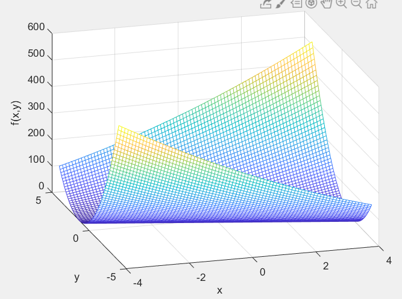
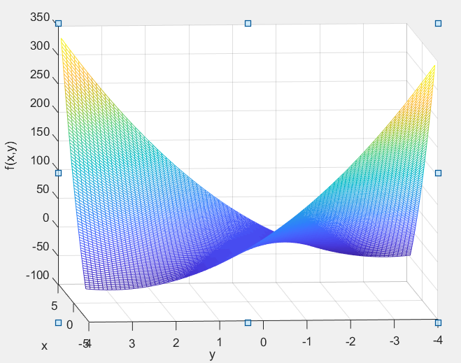
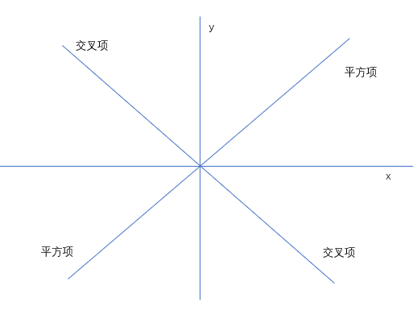

# 28. 正定矩阵和最小值

## 1. 正定矩阵

判断一个方阵是否为正定矩阵，有关条件在引入正定性的时候就给了。那么对于一个 2 阶矩阵 $A$：

$$
A =
\begin{bmatrix}
a & b \\
c & d \\
\end{bmatrix}
$$

该方阵正定的等价条件为：

1. $\lambda_1 > 0, \lambda_2 > 0$
2. $a > 0, ad - bc > 0$
3. $a > 0, \dfrac{ac - b^2}{a} > 0$

第二条和第三条看起来差不多，但是 2 应用的是主子式，而 3 使用了主元-特征值关系判断。

那么还有没有其他的判定条件呢？

这里给出一个矩阵 $A$：

$$
A =
\begin{bmatrix}
2 & 6 \\
6 & 18 \\
\end{bmatrix}
$$

（当矩阵右下角是 18，此时行列式为 0 的时候，矩阵称作半正定矩阵。特征值为 20 和 0。）

## 2. 二次型

奇思妙想地构造这样一个式子：

$$
x^TAx =
\begin{bmatrix}
x_1 & x_2 \\
\end{bmatrix}
\begin{bmatrix}
2 & 6 \\
6 & 18 \\
\end{bmatrix}
\begin{bmatrix}
x_1 \\
x_2 \\
\end{bmatrix} = 2x_1^2 + 18x_2^2 + 12x_1x_2 = 2(x_1 + 3x_2)^2
$$

看着最后一个等号右边的结构。线性代数从开始到现在，主要描述线性系统。即使出现了矩阵幂，那最终也还是线性代数的表示。
而这里出现了未知数的幂，可见这是非线性的，甚至一点线性部分都没有。

我们现在来看这个多项式的结果。由于被写成了多项式形式，然后这个式子是一个平方项。因此对于任意 $x_1,x_2$ 恒为非负。

现在假设只变化右下角的元素。
试想，如果右下角的元素不是 18，而是 19，那么肯定得到的 **多项式恒为正**。
如果右下角元素是 17，那么多项式的正负性不确定。

如果连左上角的元素都可以发生改变，那么我甚至可以通过 **某些操作**，使得多项式恒为负。

## 3. 图像

对于矩阵通过上述转化变成的多项式，可以画出相关图像：

```matlab
[x,y] = meshgrid(-4:0.1:4);

z = 2 * x .* x + 12 * x .* y + 18 * y .* y;
mesh(x,y,z),xlabel('x'),ylabel('y'),zlabel('f(x,y)')
grid on
```



可以看出的确在最有可能为负的地方，图像都表现为非负。

然后如果将右下数字从 18 改为 7。

```matlab
[x,y] = meshgrid(-4:0.1:4);

z = 2 * x .* x + 12 * x .* y + 7 * y .* y;
mesh(x,y,z),xlabel('x'),ylabel('y'),zlabel('f(x,y)')
grid on
```



（马鞍面，原点为鞍点 —— 某个方向的最大值，同时是另外某个方向的最小值）

这么看起来马鞍面好像就是把前面非负的图像，沿与 **增长最迅速**  **垂直** 的方向，将函数图像往下弯折。

而这就表明了函数表达式中的 **交叉项**。

如果我把交叉项减小，那么函数图像就向上弯曲。
（进而水平 xOy 切面由 **双曲线** 变为 **椭圆**）



那对于矩阵而言，**数值的正负就被类比为矩阵的正定性**。

对于一个多项式：$f(x,y) = 2x^2 + 12xy + 20y^2$，如果其可以写作一个正平方项（或是再加上一个非负数），那么其就是恒为非负的。

$$
f(x,y) = 2x^2 + 12xy + 20y^2 = 2(x + 3y)^2 + 2y^2
$$

（如果没有后面的 $2y^2$，那么函数图像在 $x = -3y$ 上都为 0，但由于加上这样一项，所以只有在原点处非负）

上面说过，如果把一个图像水平切割，其刨面的形状可能是个双曲线，可能是个椭圆。
那么现在要说，在具有鞍点的情况下，切割得到的是双曲线；
而在极小值情况下，切割得到的是椭圆。

## 4. 极小值

看向马鞍面或抛物面，前者有鞍点，而后者有极小值点。在高数当中，为了 **判定一个函数图像中某点** 是否为 **极大 / 极小值点**。

首先，**导数为 0** ，是必然需要的。但是这不能确定一个点究竟是极大值还是极小值。
所以其次，还需要判断那一点的 **二阶导数的正负性**。

如果在某一点函数取得 **极小值**，那么：

$$
\dfrac{du}{dx} = 0, \qquad \dfrac{d^2u}{dx^2} > 0
$$

再回顾例子中的矩阵 $A$：

$$
A =
\begin{bmatrix}
2 & 6 \\
6 & 20 \\
\end{bmatrix}
$$

我们计算二次型函数的各种二阶导数：

$$
\begin{cases}
\dfrac{\partial^2 f}{\partial x^2} = f_{xx} = 2 \\
\\
\dfrac{\partial^2 f}{\partial x \partial y} = \dfrac{\partial^2 f}{\partial y \partial x} = f_{xy} = f_{yx} = 6 \\
\\
\dfrac{\partial^2 f}{\partial y^2} = f_{yy} = 20 \\
\end{cases}
$$

发现这些数字和矩阵中的各个元素刚好对应相同：（那是因为本来就是这么算出来的，虽然意义不同，但是计算过程却差不多）

$$
A =
\begin{bmatrix}
2 & 6 \\
6 & 20 \\
\end{bmatrix} =
\begin{bmatrix}
f_{xx} & f_{xy} \\
f_{xy} & f_{yy} \\
\end{bmatrix}
$$

假使我要一矩阵表现正定性。
所以应该有以下式子（**1 阶，2 阶主子式分别 > 0**）：

$$
\begin{cases}
\dfrac{\partial^2 f}{\partial x^2} = f_{xx} > 0 \\
\\
\dfrac{\partial^2 f}{\partial x^2} \dfrac{\partial^2 f}{\partial y^2} - (\dfrac{\partial^2 f}{\partial x \partial y})^2 = f_{xx}f_{yy} - f_{xy}^2 > 0 \\
\end{cases}
$$

这个其实就是多元函数中，取得极小值的条件。
那么也就是说，**若有最小值，必定在原点处取得**。
于是就从 **二阶导数与极小值** 的关系角度，论证了 **正定性 与 函数图像** 的关系。

## 5. 高斯消元法 - 二次型配方法

重新回顾高斯消元法，对于一个矩阵 $A$：

$$
A =
\begin{bmatrix}
2 & 6 \\
6 & 20 \\
\end{bmatrix}
$$

如果进行高斯消元，我们不妨令第一行不变，第一列主元就为 2。
那么第二行主元要被计算出，必须要消去左下角的 6。

$r_2 - 3r_1：
\begin{bmatrix}
2 & 6 \\
0 & 2 \\
\end{bmatrix}$

从得到的上三角阵，可以看出第二列的主元也是 2。
由 $LU$ 分解，我们知道原矩阵必定可以被分解为 **上三角阵左乘下三角阵**：

$$
A =
LU =
\begin{bmatrix}
1 & 0 \\
3 & 1 \\
\end{bmatrix}
\begin{bmatrix}
2 & 6 \\
0 & 2 \\
\end{bmatrix}
$$

对应多项式 $f(x,y) = 2x^2 + 12xy + 20y^2 = 2(x + 3y)^2 + 2y^2$ 观察，好像：

1. 多项式平方项外面的系数，就是主元；
2. 多项式平方项里面的系数，就是消元的倍数因子。

对于每一个二次型，都可以通过配方，写成一组仅仅由平方项组成的多项式。
（这就是将 普通二次型 化为 标准型 的过程）
其中 $n$ 个未知数的二次型，配方后可以表示为：

$$
f = a_n(x_n + b_{n2}x_{n-1} + \cdots + b_{nn}x_1)^2 + a_{n-1}(x_{n-1} + b_{(n-1)3}x_{n-2} + \cdots + b_{(n-1)n}x_1)^2 + \cdots
$$

$$
f = \sum_{i = 1}^n a_i(x_i + \sum_{j = 1}^{n-1} b_{(n + 1 - i)(n + 1 - j)}x_j)^2
$$

这里，$a_i$ 就是主元，$b_{(n + 1 - i)(n + 1 - j)}$ 就是 $\dfrac{n(n-1)}{2}$ 个消元系数。
（$\dfrac{n(n-1)}{2}$ 是 **$n$ 阶下三角阵除对角元之外的元素个数**）

## 6. 三阶例子

$$
A =
\begin{bmatrix}
2 & -1 & 0 \\
-1 & 2 & -1 \\
0 & -1 & 2 \\
\end{bmatrix}
$$

这个矩阵对应的二次型是：$f = 2x_1^2 + 2x_2^2 + 2x_3^2 - 2x_1x_2 - 2x_2x_3$

计算这个矩阵的 3 个主子式：

$$
\begin{cases}
D_1 = 2 \\
D_2 = 3 \\
D_3 = 4 \\
\end{cases}
$$

3 个主子式都大于 0，那么本矩阵一定是一个正定矩阵。

如果假设第一列的主元 $Pivot$ 就是 2，那么依据 **主元-行列式** 的关系：

$$
\begin{cases}
Pivot_1 = 2 \\
\\
Pivot_2 = \dfrac{3}{2} \\
\\
Pivot_3 = \dfrac{4}{3} \\
\end{cases}
$$
