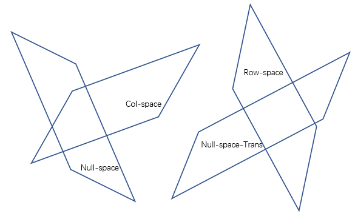
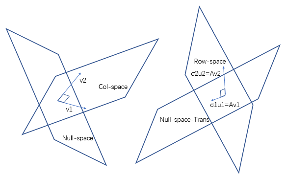

# 30. 奇异值分解

## 1. 之前的分解

对于之前，我们已经有过各式各样的分解。
诸如 $LU$ 分解（任意）、$QR$ 分解（可逆）、对角化（方阵，$n$ 个无关特征向量）、相似矩阵（方阵）、正定矩阵（对称）。

但是它们要么 **为了更好的分解形式** 有着或多或少的要求，要么由于 **分解形式不佳** 而相对不被重用。

还记得之前的对角化。
如果存在一个方阵 $A$，其拥有 $n$ 个特征值 $\lambda_1 \ge \lambda_2 \ge \cdots \ge \lambda_n$ ，那么或许本矩阵就有可能拥有 $n$ 个线性无关的特征向量。
对于这些线性无关的特征向量，利用 **施密特正交化** 就可以做到让它们两两正交。
从而把 $A = S \Lambda S^{-1}$ 写作 $A = Q \Lambda Q^T$ 的形式。
而正定矩阵当中，各个特征值又都大于 0，所以 $\Lambda$ 变成了一个对角元皆为正数的方阵。

不必说不拥有 $n$ 个线性无关特征向量的矩阵了，对于那些非方阵的矩阵，都不能利用这种分解方法。（**直至现在，矩阵如果有逆，其与逆都为方阵**）

## 2. SVD 的由来

（注：
**粉色** 代表 **正交矩阵 $Q$**；
**橙色** 代表 **特征值相关的矩阵 $\Lambda \ or\ \Sigma$**；
**绿色** 代表 **任意形状的矩阵 $A$**）

上方是 $n \times n$，$m \times n$ 的矩阵，下方是任意大小的矩阵 $m \times n$。
根据矩阵乘法的性质，它们可以被分解为右边的三个矩阵相乘的形式。

而上方的三个方阵形式，也就是代表着：$A = Q \Lambda Q^T$
这里的 $Q$ 是正交矩阵，它完成了 **特征提取** 的工作。（只要是特征向量组就可以提取特征值，不过正交的最好）

那么大胆猜想（才疏学浅还不知动机所在），是不是任意一个矩阵都可以被分解成 **两个正交矩阵** 夹另一种 **与特征值相关** 的矩阵呢。
这或许就是 $SVD$ 的出发点。因为如果可以做到，那么任意一个矩阵都可以被拆解。

## 3. 自基本子空间

### i. 子空间角度的推导

如果现在要寻找一个对于一般矩阵的分解。

对于一般的矩阵 $A$，其四个基本子空间的关系如上图所示。
（只表示垂直关系，并不意味相交了，可见两个空间没有交线）
如果我取 **行空间中的一个单位向量 $v_1$**，令其经过某种变换 $A$ 之后变为与 **列空间的单位向量 $u_1$ 平行** 的向量 $Av_1$，其中有：$Av_1 = \sigma_1 u_1$。
同理，对于另外一个与 $v_1$ 垂直的单位向量 $v_2$，做同样变换，得到与上面相似的结果。以此类推，得到 **一组行空间正交基**，在经过某种相同变换后，变成 **一组列空间正交基**。

上图可以表示为：

$$
\begin{cases}
Av_1 = \sigma_1 u_1 \\
Av_2 = \sigma_2 u_2 \\
\qquad \vdots \\
Av_n = \sigma_n u_n \\
\end{cases}
$$

转换为矩阵表达：

$$
AV = U \Sigma
$$

由于此处 $U,V$ 都是正交矩阵，有：$UU^T = VV^T = I$，所以：

$$
A = U \Sigma V^T
$$

就把这种对于任意大小矩阵都成立的分解，叫做 $SVD 分解$。
为了分解任意矩阵，要求的方阵就是 $U, V$。
对于矩阵 $A$，其转置 $A^T = V \Sigma^T U^T$。

所以：

$$
\begin{cases}
A^T A = V \Sigma^T U^T U \Sigma V^T = V (\Sigma^T \Sigma) V^T \\
\\
A A^T = U \Sigma V^T V \Sigma^T U^T = U (\Sigma \Sigma^T) U^T \\
\end{cases}
$$

对于中间的矩阵 $\Sigma$：

$$
\begin{bmatrix}
\sigma_1^2 & & & & & \\
& \sigma_2^2 & & & & \\
& & \ddots & & & \\
& & & \sigma_r^2 & & \\
& & & & \ddots & \\
& & & & & 0 \\
\\
\\
\end{bmatrix}
$$

（需要注意的是，这个矩阵不一定是一个方阵，其大小为 $m \times n$，$r$ 为原被分解的矩阵 $A$ 的秩。

1. 一旦 $r < n$，那么就会有 **全零列**；
2. 如果 $r < m$，就会有 **全零行**。

此矩阵表示的是 $r < m, r < n$ 的情形）
（更需要注意的是，这里有一个约定需要遵守：$\sigma_1 > \sigma_2 > \cdots > \sigma_r$）

### ii. 计算原理

通过上面的式子，我们发现 $\Sigma \Sigma^T$ 或者是 $\Sigma^T \Sigma$，都是 **对角阵**。
并且 $U, U^T, V, V^T$ 这 4 个方阵都是 **正交矩阵**。

所以这一组式子，很容易被理解成 $AA^T, A^TA$ 为正定矩阵，计算 $U$ 或者 $V$，就是在计算矩阵 $AA^T$ 或者 $A^TA$ 的 **正交特征向量组**：

$$
\begin{cases}
A^T A = V \Sigma^T U^T U \Sigma V^T = V (\Sigma^T \Sigma) V^T \\
\\
A A^T = U \Sigma V^T V \Sigma^T U^T = U (\Sigma \Sigma^T) U^T \\
\end{cases}
$$

上面一直都在强调 **或者** 二字，就是因为最好不要用两种方法分别求 $U, V$，因为这两个矩阵是通过等式 $AV = \Sigma V$ 关联起来的。
