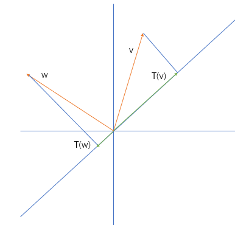
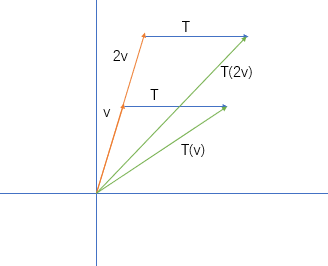
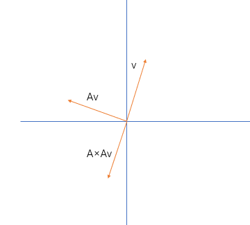

# 31. 线性变换及对应矩阵

教授的课是从这里开始的。
无论是 **第 1 节** 对 **方程组进行几何解释** 时，还是 **第 3 节** 利用不同角度看待 **矩阵乘法** 。到后面 **第 10 节** 开始用变换的思想考虑 **四个子空间**，甚至 **第 16 节** 的投影矩阵推导，教授讲述的内容都脱离不了 **线性变换** 这几个字。

换句话说。
如果矩阵不能够表示线性变换，那么矩阵不会有这么多性质和用途，很多数学问题，诸如提过的 **空间中体积求解**，**微分方程稳态**，**多元函数极值**，**傅里叶变换** 等等，都不能 凭借 **矩阵** 这个工具 完成几何上的 **形象解释**。
如果线性变换不能被矩阵表示，那么相信数学家们会找到其他办法。**特征值和特征向量**，**变换的各种分解** 依然会被提出。因为这些的概念的由来，是对线性变换作解释，而不是因为矩阵是矩阵。

线性变换才是重要的地方。

## 1. 线性变换

### i. 线性变换的直观感受

投影 是一种特殊的线性变换。
给定一个空间，令 **大于或等于给定空间维度** 的空间矩阵对其投影，可以得到一个新的矩阵。

在上图中，即是：给定一条平面上的直线，令一 2 维向量对其投影，得到一起点、终点皆在直线上的平面向量。

对于变换，还有一类叫做 **非线性变换**。
对于上面的投影，的的确确是线性变换，因为它满足：

1. 投影前后坐标原点不改变；
2. 投影前后直线仍为直线。

但是有的变换却不能满足这两条性质。
的的确确存在一类变换，能将直线变成曲线，能将坏的（不方便分类的）变成好的（容易用直线分类的），能将起点变为曾经的终点。

比如下面的平移变换：

由于这个变换 $T$ 不是 **根据不同输入值而有不同的线性输出**。（这里的变换，无论对于任何输入向量，**都是变换相同的程度**）所以看起来没有 “中位线” 相关图形的感觉。

要否定它不是一个线性变换，这里只需要看 $T(0)$，发现其输出并不是坐标原点，那还谈何线性。

但是旋转就是一个线性变换。

降维是一个线性变换。

它们这些线性变换，每一种都一定可以被矩阵描述，无论是方阵还是其他，无论可逆还是不可逆。

### ii. 线性变换的性质理解

给定一个任何线性变换 $T$ 都需要满足下面两个性质：

1. $T(k \alpha) = k T(\alpha),\ k \in R$
2. $T(\alpha) + T(\beta) = T(\alpha + \beta)$

简单地概括就是 线性变换 满足 数乘和加法 。
但是也可以用另外一种角度解释：
第 1 条性质成立是因为 **相同的线性变换所有性质相同**；第 2 条性质成立是因为 **变换是线性的，所以因变量与不同的自变量变换 各自 成一定比例**。

每一个线性变换，对于一个特定的输入，都有一个对应的输出。尽管不同的输入可能对应相同的输出，但是对同一输入的线性变换不会有多个输出。
这其实是一种映射关系：

$$
T: R^n \rightarrow R^n
$$

## 2. 基变换

如果我现在有一个线性变换 $T$，其定义了从 $n$ 维空间到 $m$ 维空间的降维变换。可是我要求新空间中的某个向量，假使都通过线性变换来转化，那未免有些麻烦。

我们可以大胆利用线性变换的性质：$T(c_1v_1 + c_2v_2 + \cdots + c_nv_n) = \sum_{i=1}^n c_iT(v_i)$，来进行推导。

在这里 $v_1$，如果恰好是原空间的一组基向量，那么对于新空间 $T(v_i)$ 会不会也是一组基呢？

我们知道，如果 **确定了原空间中的一组基**，那么就代表原空间中 **任何** 一个向量 $v$ 都可以表示为：

$$
v = c_1v_1 + c_2v_2 + \cdots + c_nv_n
$$

进行线性变换后：

$$
T(v) = T(c_1v_1) + T(c_2v_2) + \cdots + T(c_nv_n) = c_1T(v_1) + c_2T(v_2) + \cdots + c_nT(v_n)
$$

对于原空间来说，我们可以讲，在 $v_i$ 这一组基下，向量的坐标为：$(c_1, c_2, \cdots, c_n)$。平常我们不会顾及到基，那是因为正常情况下，我们使用的都是 **标准正交基** $(q_1, q_2, \cdots, q_n)$。

$$
v =
\begin{bmatrix}
3 \\
2 \\
4 \\
\end{bmatrix} = 3
\begin{bmatrix}
1 \\
0 \\
0 \\
\end{bmatrix} + 2
\begin{bmatrix}
0 \\
1 \\
0 \\
\end{bmatrix} + 4
\begin{bmatrix}
0 \\
0 \\
1 \\
\end{bmatrix}
$$

### i. 表示线性变换的矩阵

对于一般的线性变换，我们会用一个矩阵 $A$ 来表示，下面就是求这个矩阵 $A$ 的步骤：

$$
\begin{cases}
x = c_1v_1 + c_2v_2 + \cdots + c_8v_8 \\
\\
T(x) = c_1T(v_1) + c_2T(v_2) + \cdots + c_8T(v_8) \\
\end{cases}
$$

然而线性变换 $T$ 可以被描述为：

$$
\begin{cases}
T(v_1) = a_{11}v_1 + a_{12}v_2 + \cdots + a_{18}v_8 \\
T(v_2) = a_{21}v_1 + a_{22}v_2 + \cdots + a_{28}v_8 \\
\qquad \vdots \\
T(v_8) = a_{81}v_1 + a_{82}v_2 + \cdots + a_{88}v_8 \\
\end{cases}
$$

用以描述线性变换 $T$ 的矩阵 $A$ 可表示为：

$$
A =
\begin{bmatrix}
a_{11} & \cdots & a_{18} \\
\vdots & \ddots & \vdots \\
a_{81} & \cdots & a_{88} \\
\end{bmatrix}
$$

### ii. 降维矩阵

对于上述的线性变换 $T$，令原空间的 $n$ 个基为 $v_1, v_2, \cdots, v_n$，变换后的 $m$ 维空间中的基为 $u_1, u_2, \cdots, u_m$。（并且 **假定前 $m$ 个基是重合的**）

$$
\begin{cases}
v = c_1v_1 + c_2v_2 + \cdots + c_nv_n \\
\\
T(v) = c_1T(v_1) + c_2T(v_2) + \cdots + c_nT(v_n) \\
\end{cases}
$$

#### a. 方阵表示

如果进行线性变换，那么就表示，从 $m+1$ 到 $n$ 之间的所有结果全部为 0。
假设这里讨论的每个线性变换都可以被矩阵 $A$ 表示，那么不妨设一个 $n$ 阶矩阵 $A$：
（有这个假设是因为，某些变换可能需要左右乘上不同的矩阵才可以办到）

$$
A =
\begin{bmatrix}
a_{11} & \cdots & a_{1n} \\
\vdots & \ddots & \vdots \\
a_{n1} & \cdots & a_{nn} \\
\end{bmatrix}
$$

在假定情况下，我们可以得知 行或列在 $m+1$ 到 $n$ 间的元素都为 0。这样可以写出最简单的降维矩阵。
如果特别令 $n = 2, m = 1$，那么：

$$
A =
\begin{bmatrix}
1 & 0 \\
0 & 0 \\
\end{bmatrix}
$$

（行或列在 $2$ 到 $2$ 间的元素都为 0。）

#### b. 矩阵表示

矩阵表示降维，那么其为 $m$ 行 $n$ 列：$U = AV$
（$U, V$ 都为向量组）

所以得到一系列等式：

$$
\begin{cases}
T(v_1) = a_{11}u_1 + a_{12}u_2 + \cdots + a_{1n}u_m \\
\\
T(v_2) = a_{21}u_1 + a_{22}u_2 + \cdots + a_{2n}u_m \\
\\
\qquad \vdots \\
\\
T(v_n) = a_{n1}u_1 + a_{n2}u_2 + \cdots + a_{nn}u_m \\
\end{cases}
$$
