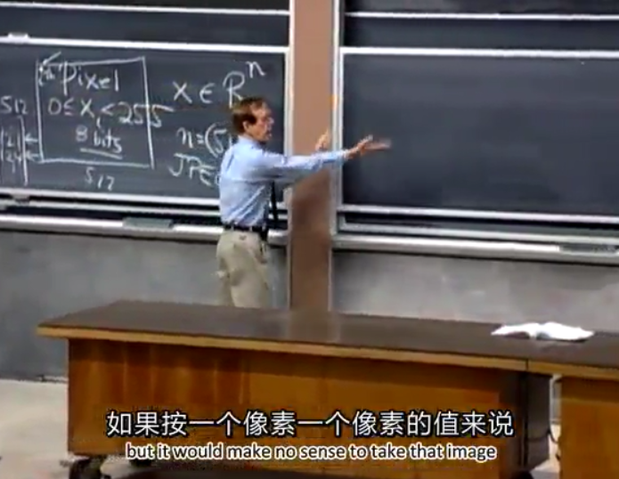
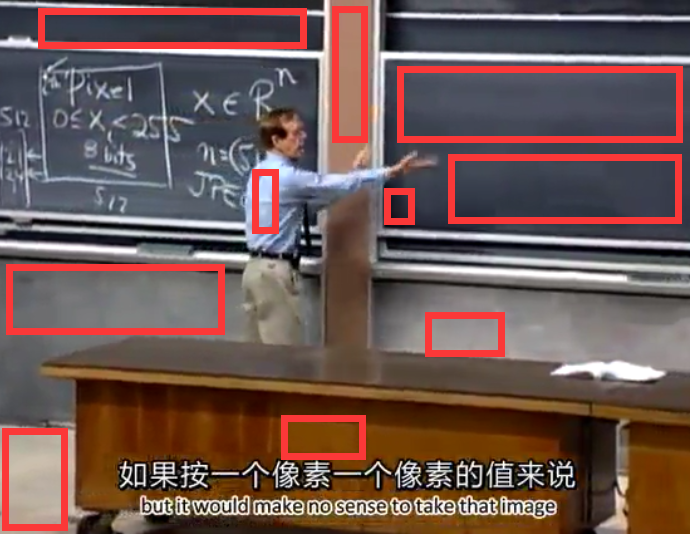

# 32. 基变换和图像压缩

## 1. 图像

一张图片是由一个个像素点组成的。
假设上面这个图片是个没有压缩过的彩色位图。（但很明显不是）
每一个像素点就都是由 32 bits 组成的，其中 RGB 24bits，alpha 通道 8 bits 以表示图像透明度信息。

对于一个灰度图（假设它的确是灰度图），每一个像素点就只有 8 bits 组成。假设图片为 $250 \times 250$ 大小，那么用 500000 bits 可以在不压缩情况下表示这么小的一张图片。

## 2. JEPG

中文含义是 “联合图像专家组”，平常看就是一种文件后缀名。
对于上面两个图片，如果把每一个像素都看成一个列向量

对于教授的这一张图片。我们可以分析出可以压缩的地方：

用红框标出的这些区域，都有一个共同的特点，那就是灰度化之后或许这些 **像素的灰度值** 大致相同，当然，现在看来，**RGB值** 也大致相同。
（还有很多区域是这样，甚至可以是粉笔写的字，可以是教授讲台上的教科书）
这些像素点区域的方差比较小，如果可以用一个方法将这些点联系起来，那么就可以大大节约存储空间。

对于这样一个 $n$ 维空间，我们一般设其基为标准正交基 （$q_1, q_2, \cdots, q_n$），因为标准正交基简单，实用，方便计算。
但是这里不采取这一组。而是选择更能完整表达一张图片信息的向量，不忽略任何一个像素点的：

$$
\begin{bmatrix}
1 \\
1 \\
\vdots \\
1 \\
1 \\
\end{bmatrix} or
\begin{bmatrix}
1 \\
-1 \\
\vdots \\
1 \\
-1 \\
\end{bmatrix} or
\begin{bmatrix}
1 \\
1 \\
\vdots \\
-1 \\
-1 \\
\end{bmatrix} or
\begin{bmatrix}
-1 \\
-1 \\
\vdots \\
1 \\
1 \\
\end{bmatrix}
$$

* 第 1 个是全 1 列；
* 第 2 个 1 与 -1 交错；
* 第 3 个上面一半是 1，下面一半是 -1；
* 第 4 个上面一半是 -1，下面一半是 1。

### i. 傅里叶基

除此之外，还有第 24 讲提过的 **傅里叶矩阵**。（抽出每一列，成为基）

$$
\begin{bmatrix}
1 \\
1 \\
\vdots \\
1 \\
1 \\
\end{bmatrix} or
\begin{bmatrix}
1 \\
\omega \\
\vdots \\
\omega^{n-2} \\
\omega^{n-1} \\
\end{bmatrix} \cdots
\begin{bmatrix}
1 \\
\omega^{n-1} \\
\vdots \\
\omega^{(n-1)(n-2)} \\
\omega^{(n-1)^2} \\
\end{bmatrix}
$$

对于一个灰度图，每一个像素，都可以写成一个灰度值。
如果把这些灰度值按列排起，就生成一个列向量。
现在就是要用上面的这组基（傅里叶变换矩阵）来表示这个列向量。

当然，**图像如果很大，这个列向量的维数一定超出想象**，所以需要将一个大的图片进行 **分割**。对每一块来分别表示。
一个 $250 \times 250$ 的图片，我们可以分割成 625 块 $10 \times 10$ 的 100 维列向量。

$$
\begin{bmatrix}
p_1 \\
p_2 \\
\vdots \\
p_{99} \\
p_{100} \\
\end{bmatrix} = c_1
\begin{bmatrix}
1 \\
1 \\
\vdots \\
1 \\
1 \\
\end{bmatrix} + c_2
\begin{bmatrix}
1 \\
\omega \\
\vdots \\
\omega^{98} \\
\omega^{99} \\
\end{bmatrix} + \cdots + c_{100}
\begin{bmatrix}
1 \\
\omega^{99} \\
\vdots \\
\omega^{9702} \\
\omega^{9801} \\
\end{bmatrix}
$$

既然用基表示，那么肯定会有一系列系数 $c_i$。
但是这些系数并不是都很重要的。
可能有的为 0，可能有的只有 0.0001。这说明有些系数 $c$ 可以被省略。
这就是阈值化处理。人工设定一个数值，比如我设定 $threshold = 0.01$，那么凡是小于这个阈值的系数，都会被舍去（化为 0），其他的则保持原样。

### ii. 小波基

对于一个 $8 \times 8$ 的空间，其小波基为：
（小波基的选择不唯一）

$$
\begin{bmatrix}
1 \\
1 \\
1 \\
1 \\
1 \\
1 \\
1 \\
1 \\
\end{bmatrix},
\begin{bmatrix}
1 \\
1 \\
1 \\
1 \\
-1 \\
-1 \\
-1 \\
-1 \\
\end{bmatrix},
\begin{bmatrix}
1 \\
1 \\
-1 \\
-1 \\
0 \\
0 \\
0 \\
0 \\
\end{bmatrix},
\begin{bmatrix}
0 \\
0 \\
0 \\
0 \\
1 \\
1 \\
-1 \\
-1 \\
\end{bmatrix},
\begin{bmatrix}
1 \\
-1 \\
0 \\
0 \\
0 \\
0 \\
0 \\
0 \\
\end{bmatrix},
\begin{bmatrix}
0 \\
0 \\
1 \\
-1 \\
0 \\
0 \\
0 \\
0 \\
\end{bmatrix},
\begin{bmatrix}
0 \\
0 \\
0 \\
0 \\
1 \\
-1 \\
0 \\
0 \\
\end{bmatrix},
\begin{bmatrix}
0 \\
0 \\
0 \\
0 \\
0 \\
0 \\
1 \\
-1 \\
\end{bmatrix}
$$

这组基的选择是有讲究的。
对于一个像素列向量的表达，一定可以写成类似于傅里叶基中的表示：

$$
\begin{bmatrix}
p_1 \\
p_2 \\
p_3 \\
p_4 \\
p_5 \\
p_6 \\
p_7 \\
p_8 \\
\end{bmatrix} = c_1
\begin{bmatrix}
1 \\
1 \\
1 \\
1 \\
1 \\
1 \\
1 \\
1 \\
\end{bmatrix} + c_2
\begin{bmatrix}
1 \\
1 \\
1 \\
1 \\
-1 \\
-1 \\
-1 \\
-1 \\
\end{bmatrix} + \cdots + c_8
\begin{bmatrix}
0 \\
0 \\
0 \\
0 \\
0 \\
0 \\
1 \\
-1 \\
\end{bmatrix}
$$

$$
P = W C
$$

（$W$ 是小波基组，$C$ 是系数列向量）
我们要确定的是系数列向量 $C$，进而推出下面的等式：

$$
C = W^{-1} P
$$

这时小波基的性质可以快速求 $W^{-1}$，只需要乘上一定的系数，$W$ 就是一个列向量标准正交的方阵 —— $W^{-1} = W^T$

压缩图像要保证两个标准：

1. 速度快。（说明运算不能太复杂）
2. 效果好。（说明更少的基就可以表示更丰富的内容）

但不一定每一组基都能够很好地完成这两个任务。

## 3. 基变换

由前面一节，知道基变换实际上就是用 **原空间的基去表示新空间的基**。矩阵表示为：

$$
旧基 = 新基 \times 过度矩阵
$$

已知一个列向量，它可以由很多种基来表示。
但是无论选择哪一组基，最终得到的一定是被表示的这个向量。
这么一说像是一句废话。正是这句废话存在，才能够构成下面这个等式：

$$
旧基 \times 旧基坐标 = 新基 \times 新基坐标
$$

对于一个在标准正交基中的向量 $x$，就有：

$$
x = WC
$$

（$C$ 表示新基下的坐标，$W$ 表示新基）

由上面的基变换式子，可以得出坐标变换法：

$$
过渡矩阵 \times 旧基坐标 = 新基坐标
$$

## 4. 何时最好

在上一节，提出了一个结论：

$$
\begin{cases}
v = c_1v_1 + c_2v_2 + \cdots + c_nv_n \\
\\
T(v) = c_1T(v_1) + c_2T(v_2) + \cdots + c_nT(v_n) \\
\end{cases}
$$

当这一系列 $v_i$ 都是 表示 **像素矩阵** 的特征向量的时候，那么 $T(v_i) = \lambda_i v_i$，此时 $A$ 是对角阵，且对角元为 **用以表示线性变换矩阵的特征值**。
